Cluster analysis of butterfly transcriptomes
========================================================

Cluster & analyze only those mapping to an Hme ortholog.


```r
library(pheatmap)
library(pvclust)
library(DESeq2)
```

```
## Loading required package: GenomicRanges
## Loading required package: BiocGenerics
## Loading required package: parallel
## 
## Attaching package: 'BiocGenerics'
## 
## The following objects are masked from 'package:parallel':
## 
##     clusterApply, clusterApplyLB, clusterCall, clusterEvalQ,
##     clusterExport, clusterMap, parApply, parCapply, parLapply,
##     parLapplyLB, parRapply, parSapply, parSapplyLB
## 
## The following object is masked from 'package:stats':
## 
##     xtabs
## 
## The following objects are masked from 'package:base':
## 
##     anyDuplicated, append, as.data.frame, as.vector, cbind,
##     colnames, do.call, duplicated, eval, evalq, Filter, Find, get,
##     intersect, is.unsorted, lapply, Map, mapply, match, mget,
##     order, paste, pmax, pmax.int, pmin, pmin.int, Position, rank,
##     rbind, Reduce, rep.int, rownames, sapply, setdiff, sort,
##     table, tapply, union, unique, unlist
## 
## Loading required package: IRanges
## Loading required package: GenomeInfoDb
## Loading required package: Rcpp
## Loading required package: RcppArmadillo
```
Let's define a function for plotting a heatmap with more descriptive names.


```r
labelled_heatmap <- function(data, meta){
  corrs <- cor(data)
	display.names <- paste(meta$Host_Plant,meta$Tissue,meta$Host.Plant.use,sep=".")
	names(display.names) <- meta$Customer_ID
	colnames(corrs) <- display.names[colnames(corrs)]
	rownames(corrs) <- colnames(corrs)
	pheatmap(corrs, cex=0.8)
}
```
... and some functions for normalization and pre-processing of counts.


```r
normalize.voom <- function(counts){
  require(limma)
	return(voom(counts)$E)
}
 
cpm.tmm <- function(counts, groups=NA){
	require(edgeR)
	if(is.na(groups)){
		d<-DGEList(counts=counts)
	}
	else{
		d<-DGEList(counts=counts, group=groups)
	}
	d <- calcNormFactors(d, method="TMM") 
	return(cpm(d, normalized.lib.sizes=TRUE))
}

common.disp <- function(counts_, group_){ 
d.edge <- DGEList(counts=counts_,group=group_)
d.edge <- calcNormFactors(d.edge)
d.edge <- estimateCommonDisp(d.edge)
return(d.edge$common.dispersion)
}

common.disp.nogrp <- function(counts_){ 
d.edge <- DGEList(counts=counts_)
d.edge <- calcNormFactors(d.edge)
d.edge <- estimateCommonDisp(d.edge)
return(d.edge$common.dispersion)
}
```
Read count table and metadata (information about samples). We remove the failed sample (B1MT) at once to keep the metadata table "in sync" with the count table - it's more convenient if they inculde exactly the same samples.


```r
counts <- read.delim("genewise_readcount2.txt",sep="\t",row.names=1)
meta  <- read.delim("rna-seqecoevowabi_relational_table2.txt",colClasses=c(rep("factor",7),"numeric"))
#meta <- meta[-which(meta$Customer_ID=="B1MT"),]
```
Define some vectors that will be useful for coloring plots later.


```r
tissue <- meta$Tissue
names(tissue) <- meta$Customer_ID
hostplant <- meta$Host_Plant
names(hostplant) <- meta$Customer_ID
pgroup <- meta$Phylogeny_group
names(pgroup) <- meta$Customer_ID
type <- meta$Host.Plant.use
names(type) <- meta$Customer_ID
```

Normalize and do a principal component analysis.


```r
tmm <- cpm.tmm(counts)
```

```
## Loading required package: edgeR
## Loading required package: limma
## 
## Attaching package: 'limma'
## 
## The following object is masked from 'package:DESeq2':
## 
##     plotMA
## 
## The following object is masked from 'package:BiocGenerics':
## 
##     plotMA
```

```r
labelled_heatmap(tmm,meta)
```

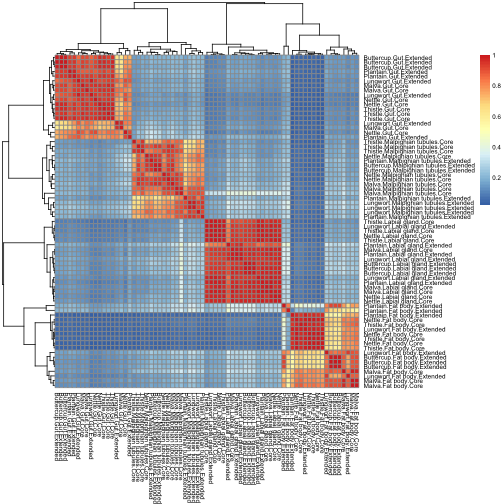 

```r
log.cpm.tmm <- normalize.voom(tmm)

columns <- intersect(meta$Customer_ID, colnames(counts))
norm.counts <- log.cpm.tmm[,columns]

temp <- rbind(HostPlantUse=as.character(meta$Host.Plant.use), norm.counts)
temp2 <- rbind(HostPlant=as.character(meta$Host_Plant), temp)
temp3 <- rbind(Tissue=as.character(meta$Tissue), temp2)
temp4 <- rbind(Family=as.character(meta$Family), temp3)
simca <- rbind(PhylogenyGroup=as.character(meta$Phylogeny_group), temp4)

write.table(simca, file="normalized_ortho_counts.txt",sep="\t",quote=F)

labelled_heatmap(log.cpm.tmm,meta)
```

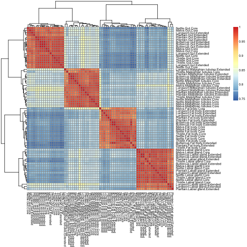 

```r
p <- prcomp(t(log.cpm.tmm))
```

Try some Anova stuff suggested on BioStar.

```r
library(reshape)
```

```
## 
## Attaching package: 'reshape'
## 
## The following objects are masked from 'package:IRanges':
## 
##     expand, rename
```

```r
m <- melt(norm.counts)
colnames(m) <- c("gene_ID","sample_ID","log-CPM")
tissue <- rep(meta$Tissue, each=nrow(norm.counts))
hostplantuse <- rep(meta$Host.Plant.use, each=nrow(norm.counts))
family <- rep(meta$Family, each=nrow(norm.counts))
phylogroup <- rep(meta$Phylogeny_group, each=nrow(norm.counts))
data <- data.frame(m, tissue=tissue, host_plant_use=hostplantuse, phylogeny_group=phylogroup, family=family)
subset <- data[sample(1:nrow(data), 50000),]
#fit <- lm(log.CPM ~ tissue + host_plant_use + phylogeny_group + family, data=data)
#fit <- lm(log.CPM ~ tissue + phylogeny_group + host_plant_use + family, data=data)

pdf("anova_comparison.pdf")
par(mfrow=c(3,1))
#barplot(a$"F value",names.arg=rownames(a), main="Anova on log-CPM",cex.names=0.7)
#dev.off()
# The above is dubious because host plant use and phylogeny group are strongly collinear, so drop each of these in turn
# Switch order
fit <- lm(log.CPM ~ phylogeny_group + host_plant_use + tissue, data=data)
a <- anova(fit)
barplot(a$"F value",names.arg=rownames(a), main="Anova on log-CPM",cex.names=0.7)

fit <- lm(log.CPM ~ host_plant_use + phylogeny_group + tissue, data=data)
a <- anova(fit)
#pdf("anova_2.pdf")
barplot(a$"F value",names.arg=rownames(a), main="Anova on log-CPM",cex.names=0.7)
#dev.off()
# Switch order
fit <- lm(log.CPM ~ tissue + phylogeny_group + host_plant_use, data=data)
a <- anova(fit)
#pdf("anova_3.pdf")
barplot(a$"F value",names.arg=rownames(a), main="Anova on log-CPM",cex.names=0.7)
dev.off()
```

```
## pdf 
##   2
```

```r
# The above is dubious because host plant use and phylogeny group are strongly collinear, so drop each of these in turn
# Without host plant use
fit <- lm(log.CPM ~ tissue + phylogeny_group + family, data=data)
a <- anova(fit)
pdf("anova_no_hostplantuse.pdf")
barplot(a$"F value",names.arg=rownames(a), main="Anova on log-CPM",cex.names=0.7)
dev.off()
```

```
## pdf 
##   2
```

```r
# Without phylogroup
fit <- lm(log.CPM ~ tissue + host_plant_use + family, data=data)
a <- anova(fit)
pdf("anova_no_phylogroup.pdf")
barplot(a$"F value",names.arg=rownames(a), main="Anova on log-CPM",cex.names=0.7)
dev.off()
```

```
## pdf 
##   2
```

```r
# Try with interactions
pdf("anova_interactions.pdf")
# (a) panel
par(mfrow=c(3,1))
fit <- lm(log.CPM ~  phylogeny_group + host_plant_use + tissue + tissue:phylogeny_group  + tissue:host_plant_use, data=data)
a <- anova(fit)
barplot(a$"F value"[-6],names.arg=rownames(a)[-6], main="Anova on log-CPM",cex.names=0.7,ylim=c(0,1000))
# (b) panel
fit <- lm(log.CPM ~ host_plant_use + phylogeny_group + tissue + tissue:phylogeny_group + tissue:host_plant_use, data=data)
a <- anova(fit)
barplot(a$"F value"[-6],names.arg=rownames(a)[-6], main="Anova on log-CPM",cex.names=0.7,ylim=c(0,1000))
# (c) panel
fit <- lm(log.CPM ~ tissue + phylogeny_group + host_plant_use + tissue:phylogeny_group + tissue:host_plant_use, data=data)
a <- anova(fit)
barplot(a$"F value"[-6],names.arg=rownames(a)[-6], main="Anova on log-CPM",cex.names=0.7,ylim=c(0,1000))
dev.off()
```

```
## pdf 
##   2
```

Visualize two of the components, colored by tissue.


```r
comp1 <- 1
comp2 <- 2
plot(p$x[,c(comp1,comp2)], col=as.numeric(tissue[colnames(counts)]),pch=20,main=paste0("PCs ", comp1, ",", comp2))
legend("topright", legend=c("Fat body","Gut","Labial gland","Malpighian tubules"),pch=20,col=1:4)
```

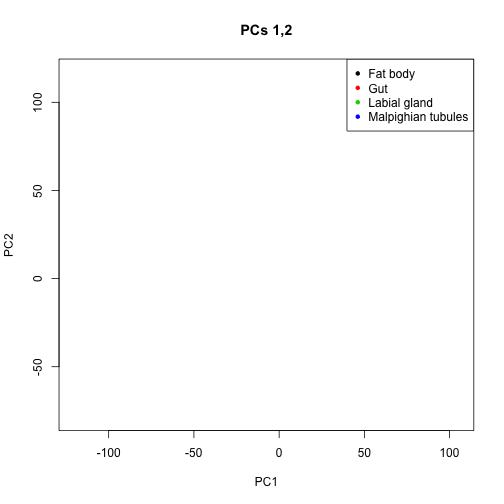 


```r
comp1 <- 1
comp2 <- 2
par(mfrow=c(2,2))
# Color by tissue
plot(p$x[,c(comp1,comp2)], col=as.numeric(tissue[colnames(counts)]),pch=20,main=paste0("Tissue, PCs ", comp1, ",", comp2))
legend("topright", legend=c("Fat body","Gut","Labial gland","Malpighian tubules"),pch=20,col=1:4)
# Color by host plant
plot(p$x[,c(comp1,comp2)], col=as.numeric(hostplant[colnames(counts)]),pch=20,main=paste0("Host plant, PCs ", comp1, ",", comp2))
legend("topright", legend=unique(hostplant),pch=20,col=1:length(unique(hostplant)))
# Color by phylogeny group
plot(p$x[,c(comp1,comp2)], col=as.numeric(pgroup[colnames(counts)]),pch=20,main=paste0("Phylogroup, PCs ", comp1, ",", comp2))
legend("topright", legend=unique(pgroup),pch=20,col=1:length(unique(pgroup)))
# Color by core vs extended
plot(p$x[,c(comp1,comp2)], col=as.numeric(type[colnames(counts)]),pch=20,main=paste0("CoreVsExtended, PCs ", comp1, ",", comp2))
legend("topright", legend=unique(type),pch=20,col=1:length(unique(type)))
```

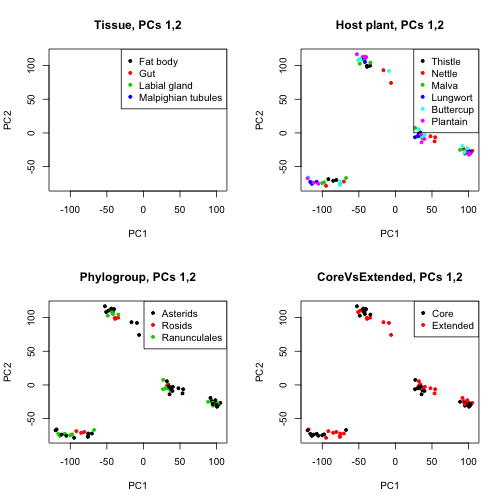 

Loop over combinations of PCs and color by family. 

```r
par(mfrow=c(4,4))
for (comp1 in 1:4){
  for (comp2 in 1:4){
		if (comp1 != comp2){
	# Color by family
	family = meta$Family
	names(family) <- meta$Customer_ID
	plot(p$x[,c(comp1,comp2)], 	col=as.numeric(family[colnames(counts)]),pch=20,main=paste0("PCs ", comp1, ",", comp2))
#legend("topright", 	legend=unique(family),pch=20,col=1:length(unique(family)))
	}
}
}
```

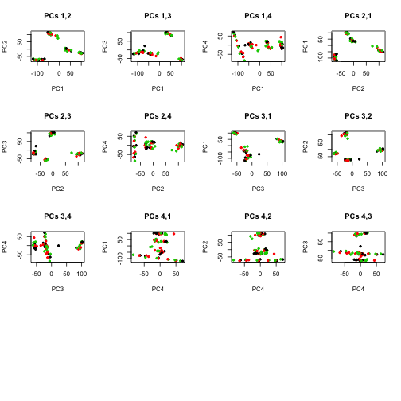 

Let's look at gut samples only, colored by core vs extended.


```r
subset <- meta[which(meta$Tissue=="Gut"),"Customer_ID"]
columns <- intersect(subset, colnames(tmm))
x <- tmm[,columns]

x.meta <- meta[which(meta$Tissue=="Labial gland"),]
x.log <- normalize.voom(x)

#p <- prcomp(t(x.log[which(rowMeans(x.log)>1),]))
p <- prcomp(t(x.log))

par(mfrow=c(5,4))
for (comp1 in 1:5){
  for (comp2 in 1:5){
		if (comp1 != comp2){
	plot(p$x[,c(comp1,comp2)], 	col=as.numeric(type[colnames(x)]),pch=20,main=paste0("PCs ", comp1, ",", comp2))
#legend("topright", 	legend=unique(family),pch=20,col=1:length(unique(family)))
	}
}
}
```

 

PCA of gut samples with more informative text labels, colored by core vs extended.


```r
par(mfrow=c(1,1))
comp1 <- 1
comp2 <- 2
plot(p$x[,c(comp1,comp2)], 	col=as.numeric(type[colnames(x.log)]),pch=20,main=paste0("PCs ", comp1, ",", comp2))
legend("topright", 	legend=unique(type),pch=20,col=1:length(unique(type)))
display.names <- paste(meta$Host_Plant,meta$Phylogeny_group,meta$Host.Plant.use,sep=".")
names(display.names) <- meta$Customer_ID
display.names.gut <- display.names[colnames(x.log)]
text(p$x[,comp1],p$x[,comp2],labels=display.names.gut,cex=0.6)
```

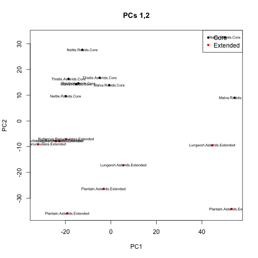 

Try clustering with bootstrapping (pvclust) on gut samples.
We have commented out the actual commands here because they take a long time to run. Instead, we read a previously saved version of the pvclust output.


```r
# Using contigs with CPM > 1
# res <- pvclust(x.log[which(rowMeans(x)>1),],nboot=100,method.hclust="complete")
# Using all contigs
# res <- pvclust(x.log,nboot=100,method.hclust="complete")
# 1000 bootstrap samples for all contigs, complete linkage
# res <- pvclust(x.log,nboot=1000,method.hclust="complete")
#save(res, file="gut_pvclust_complete_1000.Robj")
#pdf("gut_ortho_pvclust_complete_100.pdf")
#plot(res)
#dev.off()
```

Core vs extended differential gene expression in gut
====================================================
Using only gut samples (n=18).


```r
# DESeq2
subset <- meta[which(meta$Tissue=="Gut"),"Customer_ID"]
columns <- intersect(subset, colnames(counts))
meta.gut <- meta[which(meta$Tissue=="Gut"),]

dds <- DESeqDataSetFromMatrix(countData = counts[,columns], colData = meta.gut[,c("Customer_ID","Host.Plant.use","Phylogeny_group","Host_Plant","Family")], design = ~Family+Host.Plant.use)

dds <- DESeq(dds, betaPrior=FALSE)
```

```
## estimating size factors
## estimating dispersions
## gene-wise dispersion estimates
## mean-dispersion relationship
## final dispersion estimates
## fitting model and testing
```

```r
res <- results(dds)
sig <- res[which(res$padj<0.01),]
sig.o <- sig[order(sig$padj),]
print(dim(sig.o))
```

```
## [1] 213   6
```

```r
write.table(sig.o,file="sig_gut_corevsextended_DESeq2_0.01.txt",quote=F)
# 214 
```

Labial gland
-------------

```r
subset <- meta[which(meta$Tissue=="Labial gland"),"Customer_ID"]
columns <- intersect(subset, colnames(counts))
meta.lab <- meta[which(meta$Tissue=="Labial gland"),]

dds <- DESeqDataSetFromMatrix(countData = counts[,columns], colData = meta.lab[,c("Customer_ID","Host.Plant.use","Phylogeny_group","Host_Plant","Family")], design = ~Family+Host.Plant.use)

dds <- DESeq(dds, betaPrior=FALSE)
```

```
## estimating size factors
## estimating dispersions
## gene-wise dispersion estimates
## mean-dispersion relationship
## final dispersion estimates
## fitting model and testing
```

```r
res <- results(dds)
sig <- res[which(res$padj<0.01),]
sig.o <- sig[order(sig$padj),]
print(dim(sig.o))
```

```
## [1] 235   6
```

```r
write.table(sig.o,file="sig_labialgland_corevsextended_DESeq2_0.01.txt",quote=F)
```

Fat body
-------------

```r
subset <- meta[which(meta$Tissue=="Fat body"),"Customer_ID"]
columns <- intersect(subset, colnames(counts))
meta.fat <- meta[which(meta$Tissue=="Fat body"),]

dds <- DESeqDataSetFromMatrix(countData = counts[,columns], colData = meta.fat[,c("Customer_ID","Host.Plant.use","Phylogeny_group","Host_Plant","Family")], design = ~Family+Host.Plant.use)

dds <- DESeq(dds, betaPrior=FALSE)
```

```
## estimating size factors
## estimating dispersions
## gene-wise dispersion estimates
## mean-dispersion relationship
## final dispersion estimates
## fitting model and testing
```

```r
res <- results(dds)
sig <- res[which(res$padj<0.01),]
sig.o <- sig[order(sig$padj),]
print(dim(sig.o))
```

```
## [1] 668   6
```

```r
write.table(sig.o,file="sig_fatbody_corevsextended_DESeq2_0.01.txt",quote=F)
```

Malpighian tubules
-------------

```r
subset <- meta[which(meta$Tissue=="Malpighian tubules"),"Customer_ID"]
columns <- intersect(subset, colnames(counts))
meta.mal <- meta[which(meta$Tissue=="Malpighian tubules"),]

dds <- DESeqDataSetFromMatrix(countData = counts[,columns], colData = meta.mal[,c("Customer_ID","Host.Plant.use","Phylogeny_group","Host_Plant","Family")], design = ~Family+Host.Plant.use)

dds <- DESeq(dds, betaPrior=FALSE)
```

```
## estimating size factors
## estimating dispersions
## gene-wise dispersion estimates
## mean-dispersion relationship
## final dispersion estimates
## fitting model and testing
```

```r
res <- results(dds)
sig <- res[which(res$padj<0.01),]
sig.o <- sig[order(sig$padj),]
print(dim(sig.o))
```

```
## [1] 72  6
```

```r
write.table(sig.o,file="sig_malpi_corevsextended_DESeq2_0.01.txt",quote=F)
```

Use edgeR to obtain sets of DE orthologs for a variety of comparisons.
==========================================================
Fit a model using several covariates. 


```r
library(edgeR)
columns <- intersect(meta$Customer_ID, colnames(counts))
counts_ <- counts[,columns]
design=model.matrix(~0+Tissue+as.factor(Family)+Host.Plant.use+Phylogeny_group,data=meta)
y <- DGEList(counts_, group=meta$Host.Plant.use)
y <- calcNormFactors(y, method="TMM")
y <- estimateGLMCommonDisp(y,design)
y <- estimateGLMTrendedDisp(y,design)
```

```
## Loading required package: splines
```

```r
y <- estimateGLMTagwiseDisp(y,design)
edger.fit <- glmFit(y,design)
```
Extract DE orthocontigs for all the four tissues wrt the other tissues.

```r
head(edger.fit$coefficient)
```

```
##               TissueFat body TissueGut TissueLabial gland
## HMEL000002-PA        -11.126   -11.411            -10.848
## HMEL000003-PA        -14.545   -14.953            -13.978
## HMEL000004-PA         -9.933    -9.431             -9.466
## HMEL000006-PA        -12.005    -8.646             -9.402
## HMEL000007-PA        -19.821   -18.745            -19.209
## HMEL000008-PA        -11.258   -11.407            -10.915
##               TissueMalpighian tubules as.factor(Family)2
## HMEL000002-PA                   -9.218           -0.04248
## HMEL000003-PA                  -14.044            0.01371
## HMEL000004-PA                   -8.540           -0.01676
## HMEL000006-PA                   -8.375           -0.05433
## HMEL000007-PA                  -19.676           -0.12132
## HMEL000008-PA                  -11.231           -0.05093
##               as.factor(Family)3 Host.Plant.useExtended
## HMEL000002-PA          -0.102952               -0.05167
## HMEL000003-PA           0.087635                0.43358
## HMEL000004-PA          -0.002909               -0.05722
## HMEL000006-PA          -0.102052               -0.03826
## HMEL000007-PA           0.430875                1.27850
## HMEL000008-PA          -0.195918               -0.22303
##               Phylogeny_groupRanunculales Phylogeny_groupRosids
## HMEL000002-PA                      0.2273              -0.01042
## HMEL000003-PA                     -0.4564               0.13439
## HMEL000004-PA                     -0.2027               0.02535
## HMEL000006-PA                     -0.7330              -0.17288
## HMEL000007-PA                     -0.1376               1.03963
## HMEL000008-PA                      0.2156              -0.08927
```

```r
library(lattice)
# Fat body vs. other tissues
lrt <- glmLRT(edger.fit,contrast=c(1,-1/3,-1/3,-1/3,0,0,0,0,0))
temp <- topTags(lrt,n=100000)
sig.fdr <- which(as.data.frame(temp)[,"FDR"] < 0.01)
sig.fb <- as.data.frame(temp)[sig.fdr,]
for(gene in head(rownames(sig.fb))){
  expr <- t(counts_[gene,]/colSums(counts_))
  temp <- data.frame(expr=expr, tissue=meta$Tissue, core_vs_ext=meta$Host.Plant.use)
  print(bwplot(expr~tissue, data=temp, main=gene))
  readline()
}
```

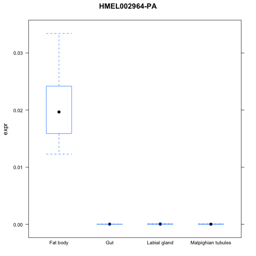 
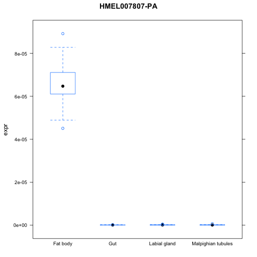 
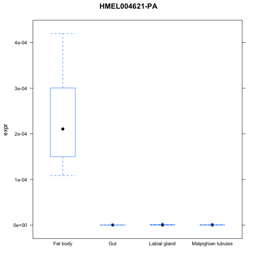 
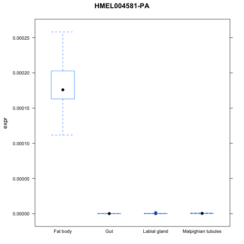 
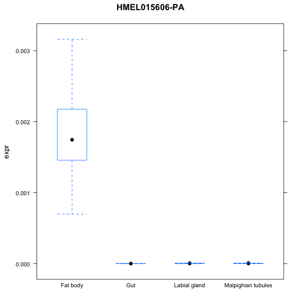 
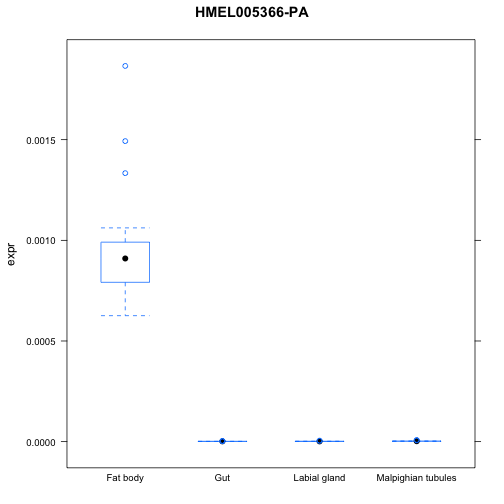 

```r
write.table(as.data.frame(topTags(lrt,n=100000)),file="fatbody_vs_other_tissues.txt",quote=F,sep="\t")
# Gut vs other tissues
lrt <- glmLRT(edger.fit,contrast=c(-1/3,1,-1/3,-1/3,0,0,0,0,0))
temp <- topTags(lrt,n=100000)
sig.fdr <- which(as.data.frame(temp)[,"FDR"] < 0.01)
sig.gut <- as.data.frame(temp)[sig.fdr,]
for(gene in head(rownames(sig.gut))){
  expr <- t(counts_[gene,]/colSums(counts_))
  temp <- data.frame(expr=expr, tissue=meta$Tissue, core_vs_ext=meta$Host.Plant.use)
  print(bwplot(expr~tissue, data=temp, main=gene))
  readline()
}
```

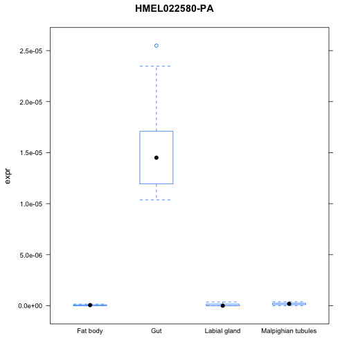 
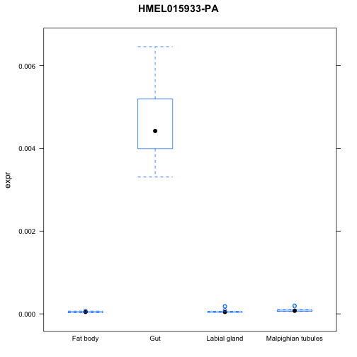 
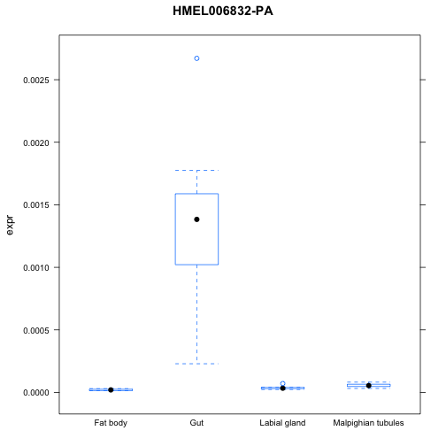 
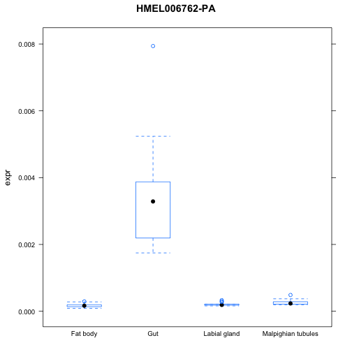 
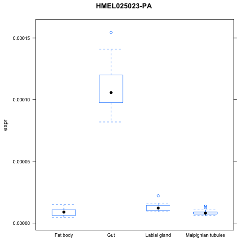 
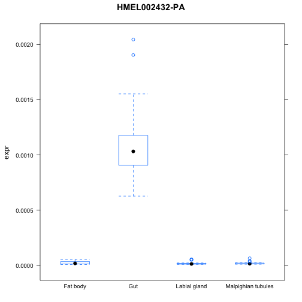 

```r
write.table(as.data.frame(topTags(lrt,n=100000)),file="gut_vs_other_tissues.txt",quote=F,sep="\t")
# Labial gland vs other tissues
lrt <- glmLRT(edger.fit,contrast=c(-1/3,-1/3,1,-1/3,0,0,0,0,0))
temp <- topTags(lrt,n=100000)
sig.fdr <- which(as.data.frame(temp)[,"FDR"] < 0.01)
sig.lg <- as.data.frame(temp)[sig.fdr,]
for(gene in head(rownames(sig.lg))){
  expr <- t(counts_[gene,]/colSums(counts_))
  temp <- data.frame(expr=expr, tissue=meta$Tissue, core_vs_ext=meta$Host.Plant.use)
  print(bwplot(expr~tissue, data=temp, main=gene))
  readline()
}
```

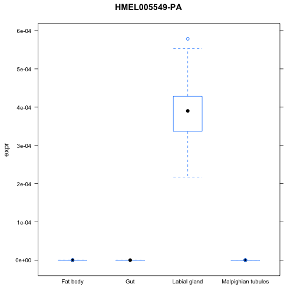 
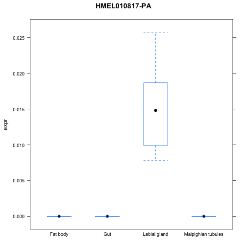 
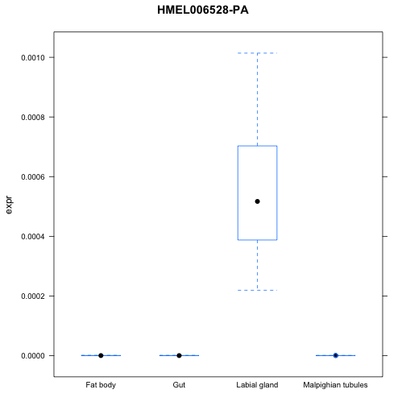 
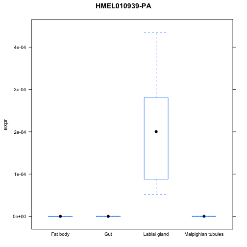 
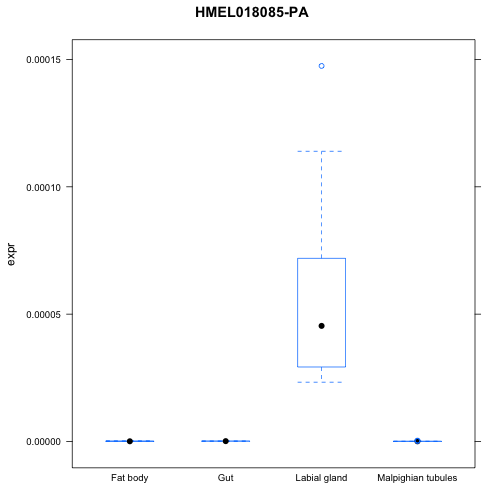 
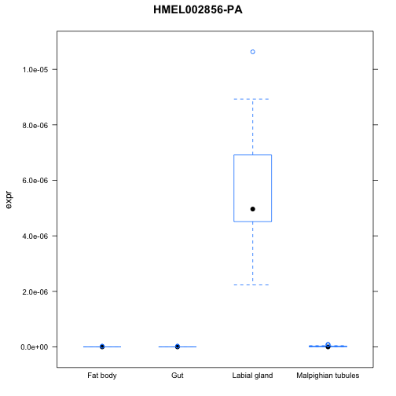 

```r
write.table(as.data.frame(topTags(lrt,n=100000)),file="labialgland_vs_other_tissues.txt",quote=F,sep="\t")

# Malpighian tubules vs other tissues
lrt <- glmLRT(edger.fit,contrast=c(-1/3,-1/3,-1/3,1,0,0,0,0,0))
temp <- topTags(lrt,n=100000)
sig.fdr <- which(as.data.frame(temp)[,"FDR"] < 0.01)
sig.mt <- as.data.frame(temp)[sig.fdr,]
for(gene in head(rownames(sig.mt))){
  expr <- t(counts_[gene,]/colSums(counts_))
  temp <- data.frame(expr=expr, tissue=meta$Tissue, core_vs_ext=meta$Host.Plant.use)
  print(bwplot(expr~tissue, data=temp, main=gene))
  readline()
}
```

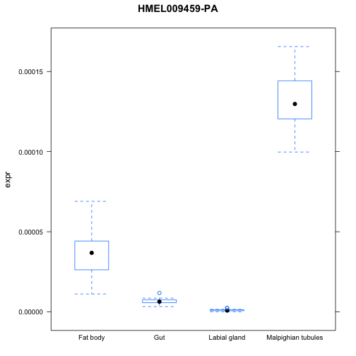 
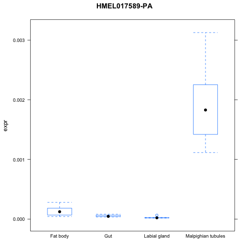 
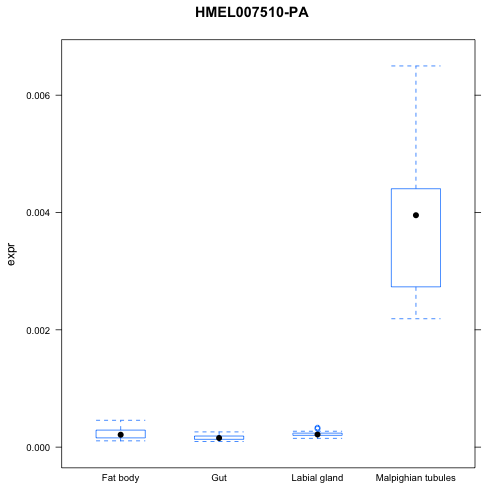 
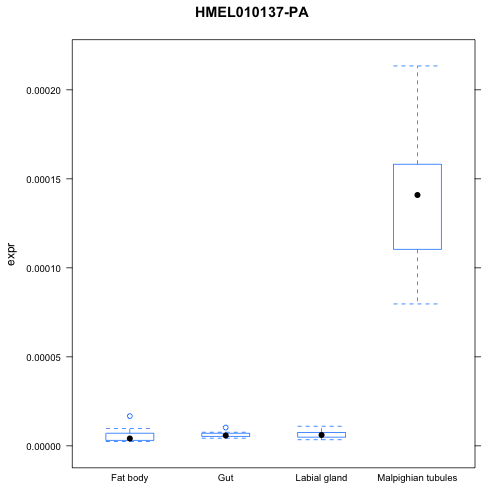 
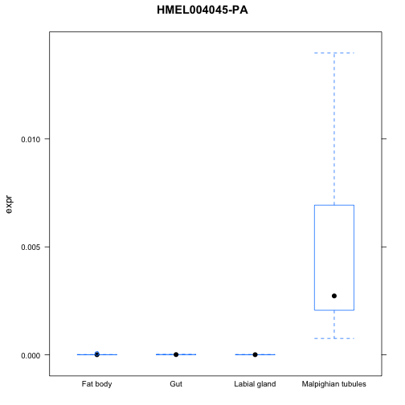 
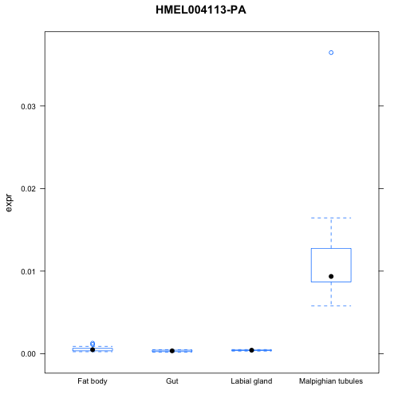 

```r
write.table(as.data.frame(topTags(lrt,n=100000)),file="malpighiantubules_vs_other_tissues.txt",quote=F,sep="\t")
```

Now test plant groups against each other. (Doesn't work well to compare one against 2)

```r
design=model.matrix(~0+Phylogeny_group+Tissue+as.factor(Family)+Host.Plant.use,data=meta)
y <- DGEList(counts_, group=meta$Host.Plant.use)
y <- calcNormFactors(y, method="TMM")
y <- estimateGLMCommonDisp(y,design)
y <- estimateGLMTrendedDisp(y,design)
y <- estimateGLMTagwiseDisp(y,design)
edger.fit <- glmFit(y,design)

# Asterids vs Ranunculales.
lrt <- glmLRT(edger.fit,contrast=c(1,-1,0,0,0,0,0,0,0))
temp <- topTags(lrt,n=100000)
sig.fdr <- which(as.data.frame(temp)[,"FDR"] < 0.01)
sig.ast <- as.data.frame(temp)[sig.fdr,]
for(gene in head(rownames(sig.ast))){
  expr <- t(counts_[gene,]/colSums(counts_))
  temp <- data.frame(expr=expr, phylogroup=meta$Phylogeny_group, core_vs_ext=meta$Host.Plant.use)
  print(bwplot(expr~phylogroup, data=temp, main=gene))
  readline()
}
```

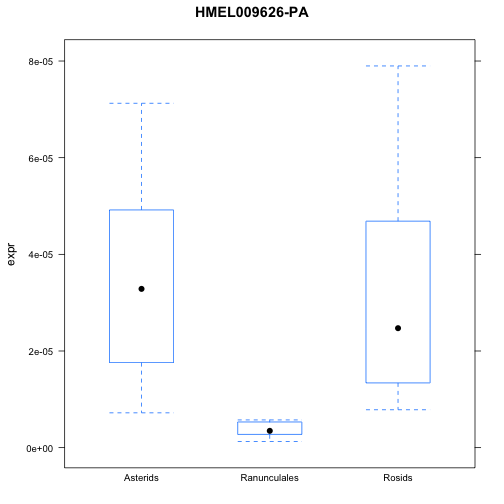 
 
 
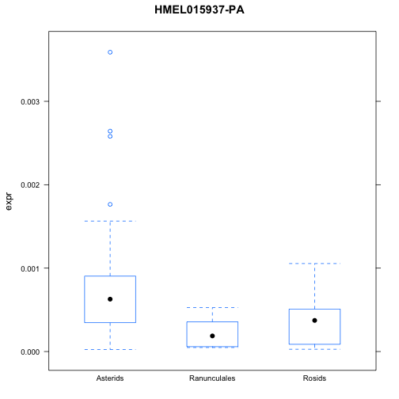 
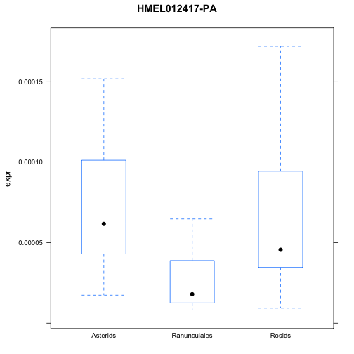 
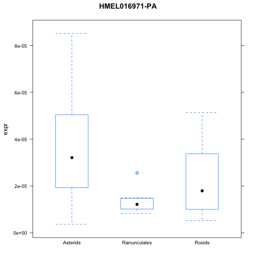 

```r
write.table(as.data.frame(topTags(lrt,n=100000)),file="Asterids_vs_Ranunculales.txt",quote=F,sep="\t")

# Ranunculales vs Rosids.
lrt <- glmLRT(edger.fit,contrast=c(0,1,-1,0,0,0,0,0,0))
temp <- topTags(lrt,n=100000)
sig.fdr <- which(as.data.frame(temp)[,"FDR"] < 0.01)
sig.ran <- as.data.frame(temp)[sig.fdr,]
for(gene in head(rownames(sig.ran))){
  expr <- t(counts_[gene,]/colSums(counts_))
  temp <- data.frame(expr=expr, phylogroup=meta$Phylogeny_group, core_vs_ext=meta$Host.Plant.use)
  print(bwplot(expr~phylogroup, data=temp, main=gene))
  readline()
}
```

 
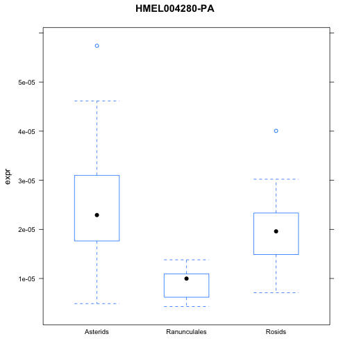 
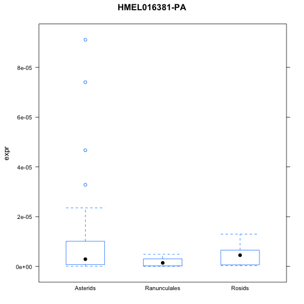 
 
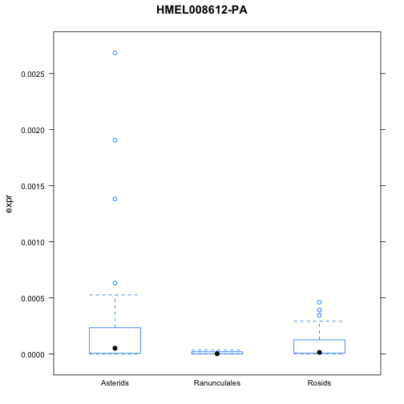 
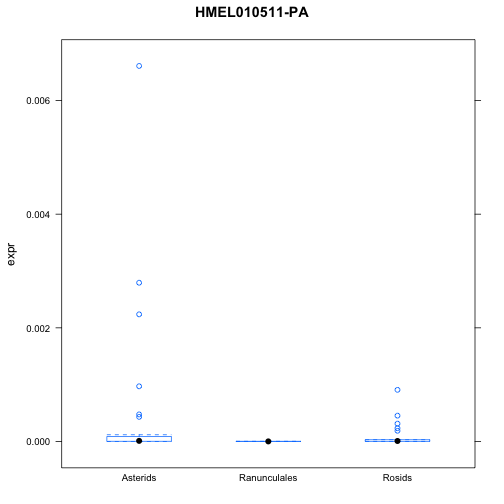 

```r
write.table(as.data.frame(topTags(lrt,n=100000)),file="Ranunculales_vs_Rosids.txt",quote=F,sep="\t")

# Rosids vs Asterids.
lrt <- glmLRT(edger.fit,contrast=c(-1,0,1,0,0,0,0,0,0))
temp <- topTags(lrt,n=100000)
sig.fdr <- which(as.data.frame(temp)[,"FDR"] < 0.01)
sig.ros <- as.data.frame(temp)[sig.fdr,]
for(gene in head(rownames(sig.ros))){
  expr <- t(counts_[gene,]/colSums(counts_))
  temp <- data.frame(expr=expr, phylogroup=meta$Phylogeny_group, core_vs_ext=meta$Host.Plant.use)
  print(bwplot(expr~phylogroup, data=temp, main=gene))
  readline()
}
```

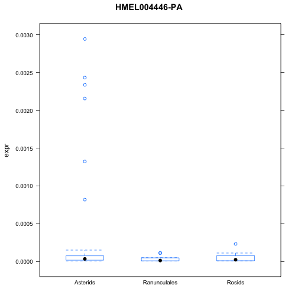 
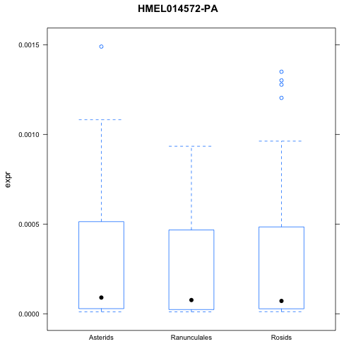 
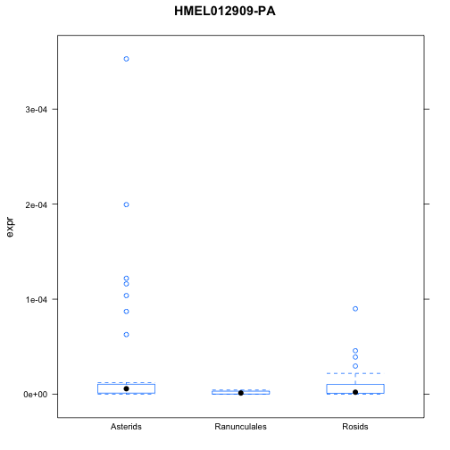 
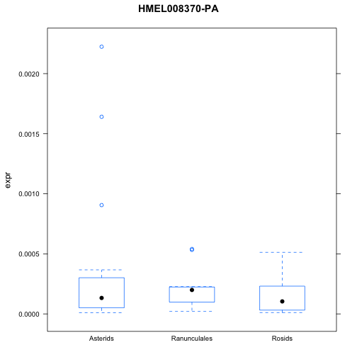 
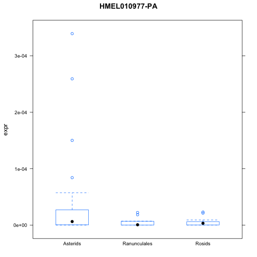 
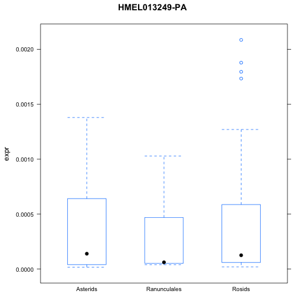 

```r
write.table(as.data.frame(topTags(lrt,n=100000)),file="Rosids_vs_Asterids.txt",quote=F,sep="\t")
```


Now test core vs extended within each tissue. (already done above with DESeq2 but let's try edgeR as well)


```r
# Fat body
subset <- meta[which(meta$Tissue=="Fat body"),"Customer_ID"]
columns <- intersect(subset, colnames(counts))
meta.fat <- meta[which(meta$Tissue=="Fat body"),]

design=model.matrix(~0+as.factor(Family)+Phylogeny_group+Host.Plant.use,data=meta.fat)
y <- DGEList(counts[,columns], group=meta.fat$Host.Plant.use)
y <- calcNormFactors(y, method="TMM")
y <- estimateGLMCommonDisp(y,design)
y <- estimateGLMTrendedDisp(y,design)
y <- estimateGLMTagwiseDisp(y,design)

edger.fit <- glmFit(y, design)
lrt <- glmLRT(edger.fit,coef="Host.Plant.useExtended")

temp <- topTags(lrt,n=100000)
sig.fdr <- which(as.data.frame(temp)[,"FDR"] < 0.01)
sig.ce.fb <- as.data.frame(temp)[sig.fdr,]
for(gene in head(rownames(sig.ce.fb))){
  expr <- t(counts_[gene,]/colSums(counts_))
  temp <- data.frame(expr=expr, tissue=meta$Tissue, core_vs_ext=meta$Host.Plant.use)
  print(bwplot(expr~core_vs_ext|tissue, data=temp, main=gene))
  readline()
}
```

 
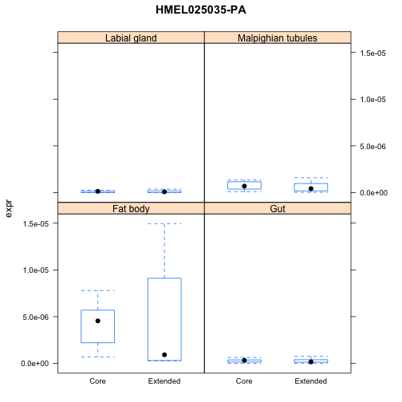 
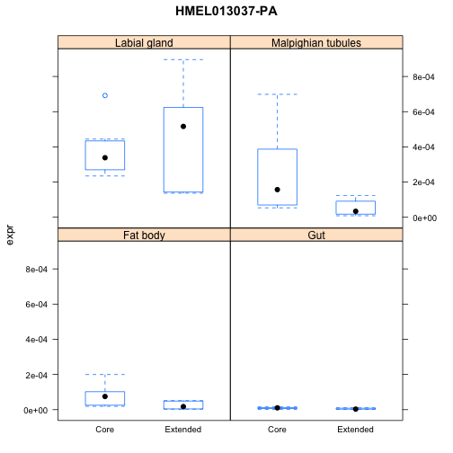 
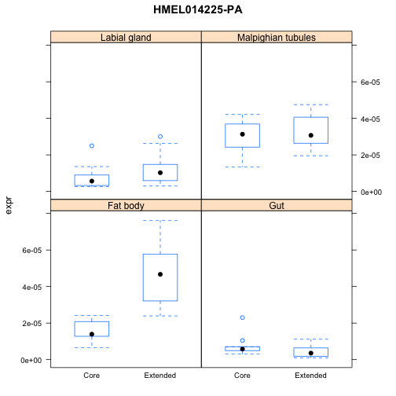 
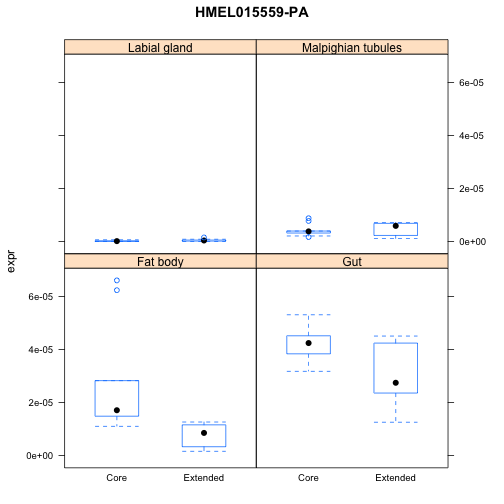 
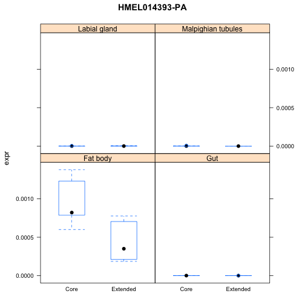 

```r
write.table(as.data.frame(topTags(lrt,n=100000)),file="Fat_body_core_vs_extended.txt",quote=F,sep="\t")

# Gut
subset <- meta[which(meta$Tissue=="Gut"),"Customer_ID"]
columns <- intersect(subset, colnames(counts))
meta.gut <- meta[which(meta$Tissue=="Gut"),]

design=model.matrix(~0+as.factor(Family)+Phylogeny_group+Host.Plant.use,data=meta.gut)
y <- DGEList(counts[,columns], group=meta.gut$Host.Plant.use)
y <- calcNormFactors(y, method="TMM")
y <- estimateGLMCommonDisp(y,design)
y <- estimateGLMTrendedDisp(y,design)
y <- estimateGLMTagwiseDisp(y,design)

edger.fit <- glmFit(y, design)
lrt <- glmLRT(edger.fit,coef="Host.Plant.useExtended")

temp <- topTags(lrt,n=100000)
sig.fdr <- which(as.data.frame(temp)[,"FDR"] < 0.01)
sig.ce.gut <- as.data.frame(temp)[sig.fdr,]
for(gene in head(rownames(sig.ce.gut))){
  expr <- t(counts_[gene,]/colSums(counts_))
  temp <- data.frame(expr=expr, tissue=meta$Tissue, core_vs_ext=meta$Host.Plant.use)
  print(bwplot(expr~core_vs_ext|tissue, data=temp, main=gene))
  readline()
}
```

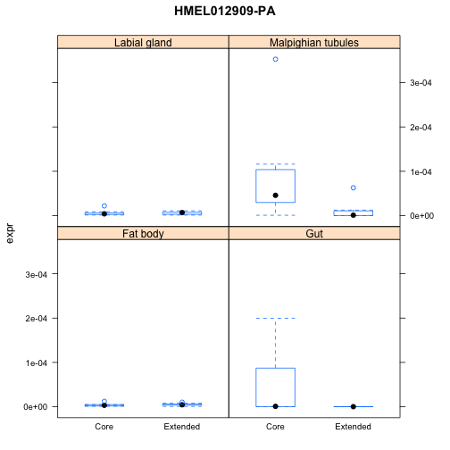 
 
 
 
 
 

```r
write.table(as.data.frame(topTags(lrt,n=100000)),file="Gut_core_vs_extended.txt",quote=F,sep="\t")


# Labial gland
subset <- meta[which(meta$Tissue=="Labial gland"),"Customer_ID"]
columns <- intersect(subset, colnames(counts))
meta.lab <- meta[which(meta$Tissue=="Labial gland"),]

design=model.matrix(~0+as.factor(Family)+Phylogeny_group+Host.Plant.use,data=meta.lab)
y <- DGEList(counts[,columns], group=meta.lab$Host.Plant.use)
y <- calcNormFactors(y, method="TMM")
y <- estimateGLMCommonDisp(y,design)
y <- estimateGLMTrendedDisp(y,design)
y <- estimateGLMTagwiseDisp(y,design)

edger.fit <- glmFit(y, design)
lrt <- glmLRT(edger.fit,coef="Host.Plant.useExtended")

temp <- topTags(lrt,n=100000)
sig.fdr <- which(as.data.frame(temp)[,"FDR"] < 0.01)
sig.ce.lg <- as.data.frame(temp)[sig.fdr,]
for(gene in head(rownames(sig.ce.lg))){
  expr <- t(counts_[gene,]/colSums(counts_))
  temp <- data.frame(expr=expr, tissue=meta$Tissue, core_vs_ext=meta$Host.Plant.use)
  print(bwplot(expr~core_vs_ext|tissue, data=temp, main=gene))
  readline()
}
```

 
 
 
 
 
 

```r
write.table(as.data.frame(topTags(lrt,n=100000)),file="Labial_gland_core_vs_extended.txt",quote=F,sep="\t")


# Malpighian tubules
subset <- meta[which(meta$Tissue=="Malpighian tubules"),"Customer_ID"]
columns <- intersect(subset, colnames(counts))
meta.mal <- meta[which(meta$Tissue=="Malpighian tubules"),]

design=model.matrix(~0+as.factor(Family)+Phylogeny_group+Host.Plant.use,data=meta.mal)
y <- DGEList(counts[,columns], group=meta.mal$Host.Plant.use)
y <- calcNormFactors(y, method="TMM")
y <- estimateGLMCommonDisp(y,design)
y <- estimateGLMTrendedDisp(y,design)
y <- estimateGLMTagwiseDisp(y,design)

edger.fit <- glmFit(y, design)
lrt <- glmLRT(edger.fit,coef="Host.Plant.useExtended")

temp <- topTags(lrt,n=100000)
sig.fdr <- which(as.data.frame(temp)[,"FDR"] < 0.01)
sig.ce.mt <- as.data.frame(temp)[sig.fdr,]
for(gene in head(rownames(sig.ce.mt))){
  expr <- t(counts[gene,columns]/colSums(counts[,columns]))
  temp <- data.frame(expr=expr, core_vs_ext=meta.mal$Host.Plant.use)
  print(bwplot(expr~core_vs_ext, data=temp, main=gene))
  readline()
}
```

 
 
 
 
 
 

```r
write.table(as.data.frame(topTags(lrt,n=100000)),file="Malpighian_tubules_core_vs_extended.txt",quote=F,sep="\t")
```

Test for differences between Family 1 and Family 3.
First test regardless of tissue. 

```{edger-family}
design=model.matrix(~0+as.factor(Family)+Phylogeny_group+Host.Plant.use+Tissue,data=meta)
y <- DGEList(counts, group=meta$Family)
y <- calcNormFactors(y, method="TMM")
y <- estimateGLMCommonDisp(y,design)
y <- estimateGLMTrendedDisp(y,design)
y <- estimateGLMTagwiseDisp(y,design)

edger.fit <- glmFit(y, design)
lrt <- glmLRT(edger.fit,contrast=c(1,0,-1,0,0,0,0,0,0))

temp <- topTags(lrt,n=100000)
sig.fdr <- which(as.data.frame(temp)[,"FDR"] < 0.01)
sig.fam <- as.data.frame(temp)[sig.fdr,]
for(gene in head(rownames(sig.fam))){
  expr <- t(counts[gene,]/colSums(counts[,]))
  temp <- data.frame(expr=expr, fam=meta$Family)
  print(bwplot(expr~fam, data=temp, main=gene))
  readline()
}

write.table(as.data.frame(topTags(lrt,n=100000)),file="Malpighian_tubules_core_vs_extended.txt",quote=F,sep="\t")

```

In nettle.


```r
# Nettle
subset <- meta[which(meta$Host_Plant=="Nettle"),"Customer_ID"]
columns <- intersect(subset, colnames(counts))
meta.net <- meta[which(meta$Host_Plant=="Nettle"),]

design=model.matrix(~0+as.factor(Family)+Tissue,data=meta.net)
y <- DGEList(counts[,columns], group=meta.net$Family)
y <- calcNormFactors(y, method="TMM")
y <- estimateGLMCommonDisp(y,design)
y <- estimateGLMTrendedDisp(y,design)
y <- estimateGLMTagwiseDisp(y,design)

edger.fit <- glmFit(y, design)
lrt <- glmLRT(edger.fit,contrast=c(1,0,-1,0,0,0))

temp <- topTags(lrt,n=100000)
sig.fdr <- which(as.data.frame(temp)[,"FDR"] < 0.05)
sig.fam.net <- as.data.frame(temp)[sig.fdr,]
for(gene in head(rownames(sig.fam.net))){
  expr <- t(counts[gene,columns]/colSums(counts[,columns]))
  temp <- data.frame(expr=expr, fam=meta.net$Family)
  print(bwplot(expr~fam, data=temp, main=gene))
  readline()
}
```

 
 
 
 
 
 

```r
write.table(as.data.frame(topTags(lrt,n=100000)),file="Fam1vsFam3_nettle.txt",quote=F,sep="\t")
```

In thistle.


```r
# Malpighian tubules
subset <- meta[which(meta$Host_Plant=="Thistle"),"Customer_ID"]
columns <- intersect(subset, colnames(counts))
meta.this <- meta[which(meta$Host_Plant=="Thistle"),]

design=model.matrix(~0+as.factor(Family)+Tissue,data=meta.this)
y <- DGEList(counts[,columns], group=meta.this$Family)
y <- calcNormFactors(y, method="TMM")
y <- estimateGLMCommonDisp(y,design)
y <- estimateGLMTrendedDisp(y,design)
y <- estimateGLMTagwiseDisp(y,design)

edger.fit <- glmFit(y, design)
lrt <- glmLRT(edger.fit,contrast=c(1,0,-1,0,0,0))

temp <- topTags(lrt,n=100000)
sig.fdr <- which(as.data.frame(temp)[,"FDR"] < 0.05)
sig.fam.this <- as.data.frame(temp)[sig.fdr,]
for(gene in head(rownames(sig.fam.this))){
  expr <- t(counts[gene,columns]/colSums(counts[,columns]))
  temp <- data.frame(expr=expr, fam=meta.this$Family)
  print(bwplot(expr~fam, data=temp, main=gene))
  readline()
}
```

 
 
 
 
 
 

```r
write.table(as.data.frame(topTags(lrt,n=100000)),file="Fam1vsFam3_thistle.txt",quote=F,sep="\t")
```

Test the host plant use/tissue interaction. "Differences due to host plant use after accounting for tissue differences"


```r
design=model.matrix(~Tissue*Host.Plant.use,data=meta)
y <- DGEList(counts_, group=meta$Host.Plant.use)
y <- calcNormFactors(y, method="TMM")
y <- estimateGLMCommonDisp(y,design)
y <- estimateGLMTrendedDisp(y,design)
y <- estimateGLMTagwiseDisp(y,design)
edger.fit <- glmFit(y,design)
lrt <- glmLRT(edger.fit,coef="Host.Plant.useExtended") 
temp <- topTags(lrt,n=10000)
sig.fdr <- which(as.data.frame(temp)[,"FDR"] < 0.01)
sig.edger <- as.data.frame(temp)[sig.fdr,]
```


```r
nf <- calcNormFactors(counts_)
design=model.matrix(~as.factor(Family)+Phylogeny_group+Tissue+Host.Plant.use,data=meta) # The same as for edgeR
voom.data <- voom(counts_, design, lib.size = colSums(counts_) * nf)

fit <- lmFit(voom.data, design)
fit <- eBayes(fit) # To calculate p values

fit2 <- contrasts.fit(fit, contrast.matrix)
```

```
## Error: object 'contrast.matrix' not found
```

```r
fit2 <- eBayes(fit2)
```

```
## Error: object 'fit2' not found
```

```r
pvalues <- fit2$p.value
```

```
## Error: object 'fit2' not found
```

```r
pdf("sig_ortho_count.pdf")
barplot(colSums(fit$p.value[,-1] < 0.05),las=2,names.arg=c("Fam2","Fam3","Ranunc","Rosids","Gut","Labial","Malpigh","Extended"),main="Orthologs with p<0.05 for coefficient")
dev.off()
```

```
## pdf 
##   2
```

```r
pdf("pvalue_dist_ortho.pdf")
boxplot(fit$p.value[,-1],las=2,names=c("Fam2","Fam3","Ranunc","Rosids","Gut","Labial","Malpigh","Extended"),main="p value distribution for coefficients")
dev.off()
```

```
## pdf 
##   2
```

```r
adj.p <- p.adjust(pvalues, method="BH")
```

```
## Error: object 'pvalues' not found
```

```r
alpha = 0.05
sig <- adj.p[adj.p<alpha]
```

```
## Error: object 'adj.p' not found
```

```r
sig.o <- sig[order(sig)]
```

```
## Error: invalid subscript type
```

```r
print(paste(length(sig), "differentially expressed genes"))
```

```
## [1] "6 differentially expressed genes"
```

```r
# Ordinary t statistics
ord.t.stat <- fit2$coef/fit2$stdev.unscaled/fit2$sigma
```

```
## Error: object 'fit2' not found
```

```r
ord.t.stat <- fit$coef/fit$stdev.unscaled/fit$sigma
```

Plot some examples of genes with low p values. These are differentially expressed in core vs extended overall, that is, considering all tissues.


```r
library(lattice)

for (gene in head(rownames(sig.edger))){
  expr <- t(counts_[gene,]/colSums(counts_))
  temp <- data.frame(expr=expr, tissue=meta$Tissue, core_vs_ext=meta$Host.Plant.use)
  print(bwplot(expr~core_vs_ext|tissue, data=temp, main=gene))
  readline()
}
```

 
 
 
 
 
 

Try to look for "specific"/"binary" contigs
===========================================


```r
plotcore <- function(genes, counts){
for (gene in genes){
  expr <- t(counts[gene,]/colSums(counts))
  temp <- data.frame(expr=expr, tissue=meta$Tissue, core=meta$Host.Plant.use)
  print(bwplot(expr~core|tissue, data=temp, main=gene))
  readline()
}
}
```


```r
columns <- intersect(meta$Customer_ID, colnames(counts))
counts_ <- counts[,columns]
core <- meta[which(meta$Host.Plant.use=="Core"),"Customer_ID"]
extended <- meta[which(meta$Host.Plant.use=="Extended"),"Customer_ID"]
columns.core <- intersect(core, colnames(counts_))
columns.extended <- intersect(extended, colnames(counts_))
count.core <- counts_[,columns.core]
count.extended <- counts_[,columns.extended]

core.mean <- rowMeans(count.core)
ext.mean <- rowMeans(count.extended)
length(which(core.mean==0)) 
```

```
## [1] 187
```

```r
length(which(ext.mean==0))
```

```
## [1] 8
```

```r
zero.in.core <- which(core.mean==0 & ext.mean != 0)
plotcore(names(zero.in.core),counts_)
```

 
 
 
 
 
 
 
 
 
 
 
 
 
 
 
 
 
 
 
 
 
 
 
 
 
 
 
 
 
 
 
 
 
 
 
 
 
 
 
 
 
 
 
 
 
 
 
 
 
 
 
 
 
 
 
 
 
 
 
 
 
 
 
 
 
 
 
 
 
 
 
 
 
 
 
 
 
 
 
 
 
 
 
 
 
 
 
 
 
 
 
 
 
 
 
 
 
 
 
 
 
 
 
 
 
 
 
 
 
 
 
 
 
 
 
 
 
 
 
 
 
 
 
 
 
 
 
 
 
 
 
 
 
 
 
 
 
 
 
 
 
 
 
 
 
 
 
 
 
 
 
 
 
 
 
 
 
 
 
 
 
 
 
 
 
 
 
 
 
 
 
 
 
 
 
 
 
 
 
 

```r
which(core.mean < 1 & ext.mean > 5)
```

```
## HMEL004016-PA HMEL007289-PA HMEL008728-PA HMEL011034-PA HMEL011306-PA 
##          1188          3143          4029          5466          5625 
## HMEL025050-PB 
##         10040
```

Differential expression between phylogenetic groups
===================================================

Using all samples, with family and tissue as factors.


```r
plotphylo <- function(sig, counts){
for (gene in head(rownames(sig))){
  expr <- t(counts[gene,]/colSums(counts))
  temp <- data.frame(expr=expr, tissue=meta$Tissue, phylo=meta$Phylogeny_group)
  print(bwplot(expr~phylo|tissue, data=temp, main=gene))
}
}
```

Rosids vs. Ranunculales
-----------------------


```r
columns <- intersect(meta$Customer_ID, colnames(counts))
counts_ <- counts[,columns]

dds <- DESeqDataSetFromMatrix(countData = counts_, colData = meta[,c("Customer_ID","Host.Plant.use","Phylogeny_group","Host_Plant","Tissue","Family")], design = ~Tissue+Family+Phylogeny_group)

dds <- DESeq(dds, betaPrior=FALSE, fitType="local")
```

```
## estimating size factors
## estimating dispersions
## gene-wise dispersion estimates
## mean-dispersion relationship
## final dispersion estimates
## fitting model and testing
```

```r
#res <- results(dds, contrast=c("Phylogeny_group","Rosids","Asterids"))
res <- results(dds, contrast=c("Phylogeny_group","Rosids","Ranunculales"))
#res <- results(dds, contrast=c("Phylogeny_group","Ranunculales","Asterids"))
sig <- res[which(res$padj<0.01),]
sig.o <- sig[order(sig$padj),]
head(sig.o)
```

```
## log2 fold change (MAP): Phylogeny_group Rosids vs Ranunculales 
## Wald test p-value: Phylogeny_group Rosids vs Ranunculales 
## DataFrame with 6 rows and 6 columns
##                baseMean log2FoldChange     lfcSE      stat    pvalue
##               <numeric>      <numeric> <numeric> <numeric> <numeric>
## HMEL009626-PA    692.99          3.084    0.1601    19.265 1.056e-82
## HMEL008644-PA     82.07          3.694    0.3184    11.602 4.042e-31
## HMEL012417-PA   1573.47          1.499    0.1690     8.872 7.210e-19
## HMEL017148-PA    150.12          2.045    0.2384     8.579 9.580e-18
## HMEL009684-PA  10067.83          2.011    0.2386     8.429 3.487e-17
## HMEL006882-PA   3306.66          1.428    0.1716     8.321 8.704e-17
##                    padj
##               <numeric>
## HMEL009626-PA 8.052e-79
## HMEL008644-PA 1.541e-27
## HMEL012417-PA 1.832e-15
## HMEL017148-PA 1.826e-14
## HMEL009684-PA 5.318e-14
## HMEL006882-PA 1.106e-13
```

```r
print(dim(sig.o))
```

```
## [1] 403   6
```

```r
plotphylo(sig.o, counts_)
```

      

```r
write.table(sig.o,file="sig_rosids_ranunc_alltissues_DESeq2_0.01.txt",quote=F)
```


Rosids vs. Asterids
-----------------------


```r
res <- results(dds, contrast=c("Phylogeny_group","Rosids","Asterids"))
sig <- res[which(res$padj<0.01),]
sig.o <- sig[order(sig$padj),]
head(sig.o)
```

```
## log2 fold change: Phylogeny group Rosids vs Asterids 
## Wald test p-value: Phylogeny group Rosids vs Asterids 
## DataFrame with 6 rows and 6 columns
##                baseMean log2FoldChange     lfcSE      stat    pvalue
##               <numeric>      <numeric> <numeric> <numeric> <numeric>
## HMEL003790-PA    348.23        -0.5371   0.07378    -7.280 3.347e-13
## HMEL009525-PA    201.73        -0.6158   0.08576    -7.181 6.935e-13
## HMEL011845-PA    142.78        -1.2443   0.17627    -7.059 1.671e-12
## HMEL012134-PA  22542.25         1.0331   0.14715     7.020 2.213e-12
## HMEL015874-PA     97.43        -0.9656   0.13855    -6.969 3.189e-12
## HMEL012591-PA    820.98        -2.0469   0.29790    -6.871 6.360e-12
##                    padj
##               <numeric>
## HMEL003790-PA 2.693e-09
## HMEL009525-PA 2.790e-09
## HMEL011845-PA 4.452e-09
## HMEL012134-PA 4.452e-09
## HMEL015874-PA 5.133e-09
## HMEL012591-PA 8.530e-09
```

```r
print(dim(sig.o))
```

```
## [1] 1448    6
```

```r
plotphylo(sig.o, counts_)
```

      

```r
write.table(sig.o,file="sig_rosids_asterids_alltissues_DESeq2_0.01.txt",quote=F)
```

Ranunculales vs. Asterids
-----------------------


```r
res <- results(dds, contrast=c("Phylogeny_group","Ranunculales","Asterids"))
sig <- res[which(res$padj<0.01),]
sig.o <- sig[order(sig$padj),]
head(sig.o)
```

```
## log2 fold change: Phylogeny group Ranunculales vs Asterids 
## Wald test p-value: Phylogeny group Ranunculales vs Asterids 
## DataFrame with 6 rows and 6 columns
##                baseMean log2FoldChange     lfcSE      stat     pvalue
##               <numeric>      <numeric> <numeric> <numeric>  <numeric>
## HMEL009626-PA    692.99         -3.241    0.1525   -21.255 2.966e-100
## HMEL008644-PA     82.07         -3.846    0.3064   -12.551  3.927e-36
## HMEL012417-PA   1573.47         -1.771    0.1600   -11.068  1.791e-28
## HMEL006882-PA   3306.66         -1.753    0.1625   -10.792  3.774e-27
## HMEL005487-PA   1693.13          1.079    0.1042    10.351  4.125e-25
## HMEL015937-PA  14402.14         -2.296    0.2314    -9.921  3.378e-23
##                    padj
##               <numeric>
## HMEL009626-PA 2.387e-96
## HMEL008644-PA 1.580e-32
## HMEL012417-PA 4.805e-25
## HMEL006882-PA 7.593e-24
## HMEL005487-PA 6.639e-22
## HMEL015937-PA 4.530e-20
```

```r
print(dim(sig.o))
```

```
## [1] 1985    6
```

```r
plotphylo(sig.o, counts_)
```

      

```r
write.table(sig.o,file="sig_ranunc_asterids_alltissues_DESeq2_0.01.txt",quote=F)
```
