Cluster analysis of butterfly transcriptomes
============================================

Pre-processing and normalization
--------------------------------

Cluster & analyze only those mapping to an Hme ortholog.

``` r
library("pheatmap")
library("pvclust")
library("DESeq2")
library("lattice")
library("reshape")
library("sva")
library("edgeR")
```

Let's define a function for plotting a heatmap with more descriptive names.

``` r
labelled_heatmap <- function(data, meta){
  corrs <- cor(data)
    display.names <- paste(meta$Host_Plant,meta$Tissue,meta$Host.Plant.use,sep=".")
    names(display.names) <- meta$Customer_ID
    colnames(corrs) <- display.names[colnames(corrs)]
    rownames(corrs) <- colnames(corrs)
    pheatmap(corrs, cex=0.8)
}
```

... and some functions for normalization and pre-processing of counts.

``` r
normalize.voom <- function(counts){
  require(limma)
    return(voom(counts)$E)
}
 
cpm.tmm <- function(counts, groups=NA){
    require("edgeR")
    if(is.na(groups)){
        d<-DGEList(counts=counts)
    }
    else{
        d<-DGEList(counts=counts, group=groups)
    }
    d <- calcNormFactors(d, method="TMM") 
    return(cpm(d, normalized.lib.sizes=TRUE))
}

common.disp <- function(counts_, group_){ 
d.edge <- DGEList(counts=counts_,group=group_)
d.edge <- calcNormFactors(d.edge)
d.edge <- estimateCommonDisp(d.edge)
return(d.edge$common.dispersion)
}

common.disp.nogrp <- function(counts_){ 
d.edge <- DGEList(counts=counts_)
d.edge <- calcNormFactors(d.edge)
d.edge <- estimateCommonDisp(d.edge)
return(d.edge$common.dispersion)
}
```

Read count table and metadata (information about samples).

``` r
counts <- read.delim("genewise_readcount2.txt",sep="\t",row.names=1)
meta  <- read.delim("rna-seqecoevowabi_relational_table2.txt",colClasses=c(rep("factor",7),"numeric"))
```

Define some vectors that will be useful for coloring plots later.

``` r
tissue_ <- meta$Tissue
names(tissue_) <- meta$Customer_ID
hostplant_ <- meta$Host_Plant
names(hostplant_) <- meta$Customer_ID
pgroup_ <- meta$Phylogeny_group
names(pgroup_) <- meta$Customer_ID
type_ <- meta$Host.Plant.use
names(type_) <- meta$Customer_ID
```

Normalize, create a table to use in SIMCA (for PLS-DA) and plot heat maps before and after log transformation.

``` r
tmm <- cpm.tmm(counts)
labelled_heatmap(tmm,meta)
```

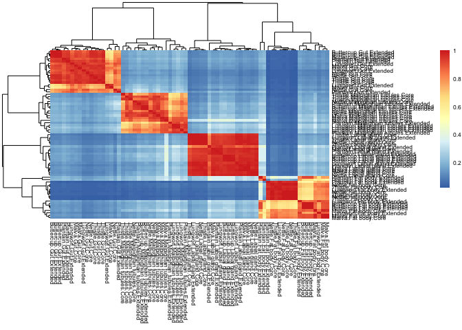

``` r
log.cpm.tmm <- normalize.voom(tmm)

columns <- intersect(as.character(meta$Customer_ID), colnames(counts))
norm.counts <- log.cpm.tmm[,columns]

temp <- rbind(HostPlantUse=as.character(meta$Host.Plant.use), norm.counts)
temp2 <- rbind(HostPlant=as.character(meta$Host_Plant), temp)
temp3 <- rbind(Tissue=as.character(meta$Tissue), temp2)
temp4 <- rbind(Family=as.character(meta$Family), temp3)
simca <- rbind(PhylogenyGroup=as.character(meta$Phylogeny_group), temp4)

write.table(simca, file="normalized_ortho_counts.txt",sep="\t",quote=F)

labelled_heatmap(log.cpm.tmm,meta)
```

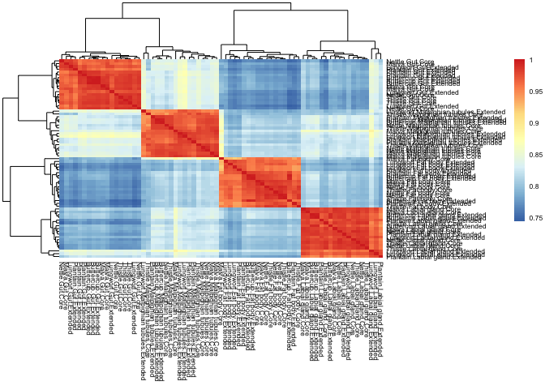

Different approaches to quantifying the influence of various factors to gene expression profiles
------------------------------------------------------------------------------------------------

We are interested in finding out which factors are the most important for determining gene expression profiles. The factors we consider for each sample are: (1) tissue, (2) phylogeny group of the plant the larva was raised on, (3) "core vs extended", that is, the type of feeding repertoire that the plant belongs to, (4) the family of the larva and in some cases (5) the identity of the plant.

We use the following methods:

-   ANOVA on linear models of gene expression
-   Principal component analysis (PCA) to visualize and color plots by different factors
-   OPLS-DA (done outside of R, in SIMCA), a supervised method where we try to predict the value (level) of a factor from the gene expression profiles in order to rank the factors by "predictability" from gene expression data
-   Surrogate Variable Analysis (SVA) to "blindly" detect the strongest tendencies in the gene expression data (after tissue has been factored out.) The correlations of the resulting latent (surrogate) variables to the factors will indicate which are most distinctive.

### ANOVA analysis of linear models for genes

``` r
m <- melt(norm.counts)
colnames(m) <- c("gene_ID","sample_ID","log-CPM")
tissue <- rep(meta$Tissue, each=nrow(norm.counts))
hostplantuse <- rep(meta$Host.Plant.use, each=nrow(norm.counts))
family <- rep(meta$Family, each=nrow(norm.counts))
phylogroup <- rep(meta$Phylogeny_group, each=nrow(norm.counts))
data <- data.frame(m, tissue=tissue, host_plant_use=hostplantuse, phylogeny_group=phylogroup, family=family)

#pdf("anova_comparison.pdf")
par(mfrow=c(3,1))

# Use different orderings of the factors, because the results will depend on the ordering.
# PHYLOGROUP-HOSTPLANTUSE-TISSUE
fit <- lm(log.CPM ~ phylogeny_group + host_plant_use + tissue, data=data)
a <- anova(fit)
barplot(a$"F value",names.arg=rownames(a), main="Anova on log-CPM",cex.names=0.7)
# HOSTPLANTUSE-PHYLOGROUP-TISSUE
fit <- lm(log.CPM ~ host_plant_use + phylogeny_group + tissue, data=data)
a <- anova(fit)
#pdf("anova_2.pdf")
barplot(a$"F value",names.arg=rownames(a), main="Anova on log-CPM",cex.names=0.7)
#dev.off()
# TISSUE-PHYLOGROUP-HOSTPLANTUSE
fit <- lm(log.CPM ~ tissue + phylogeny_group + host_plant_use, data=data)
a <- anova(fit)
#pdf("anova_3.pdf")
barplot(a$"F value",names.arg=rownames(a), main="Anova on log-CPM",cex.names=0.7)
```

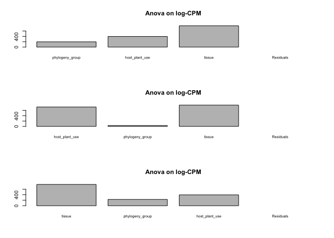

``` r
#dev.off()
# Since host plant use and phylogeny group are strongly collinear, drop each of these in turn.
# Without host plant use
fit <- lm(log.CPM ~ tissue + phylogeny_group + family, data=data)
a <- anova(fit)
#pdf("anova_no_hostplantuse.pdf")
barplot(a$"F value",names.arg=rownames(a), main="Anova on log-CPM",cex.names=0.7)
#dev.off()
# Without phylogroup
fit <- lm(log.CPM ~ tissue + host_plant_use + family, data=data)
a <- anova(fit)
#pdf("anova_no_phylogroup.pdf")
barplot(a$"F value",names.arg=rownames(a), main="Anova on log-CPM",cex.names=0.7)
#dev.off()
```

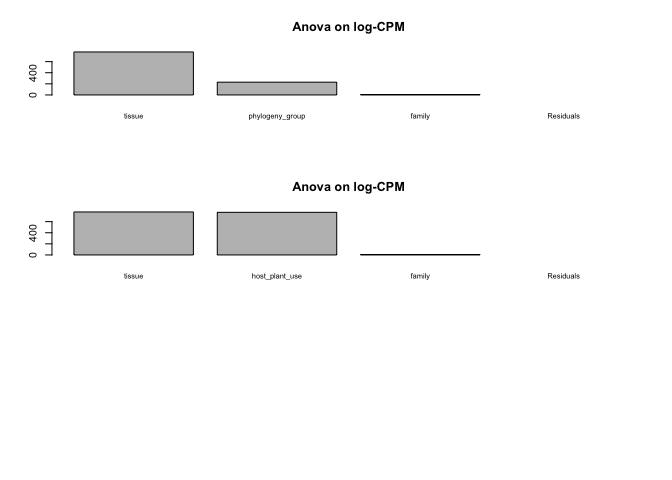

All of the plots so far indicate that tissue is the strongest contributor, followed by host plant use.

``` r
# Try with interactions
#pdf("anova_interactions.pdf")
# (a) panel
par(mfrow=c(3,1))
fit <- lm(log.CPM ~  phylogeny_group + tissue + host_plant_use + tissue:phylogeny_group  + tissue:host_plant_use, data=data)
#fit <- lm(log.CPM ~ ranunc + tissue + host_plant_use + tissue:ranunc  + tissue:host_plant_use, data=data)
a <- anova(fit)
barplot(a$"F value"[-6],names.arg=rownames(a)[-6], main="Anova on log-CPM",cex.names=0.7,ylim=c(0,1000))
# (b) panel
fit <- lm(log.CPM ~ host_plant_use + phylogeny_group + tissue + tissue:phylogeny_group + tissue:host_plant_use, data=data)
a <- anova(fit)
barplot(a$"F value"[-6],names.arg=rownames(a)[-6], main="Anova on log-CPM",cex.names=0.7,ylim=c(0,1000))
# (c) panel
fit <- lm(log.CPM ~ tissue + phylogeny_group + host_plant_use + tissue:phylogeny_group + tissue:host_plant_use, data=data)
a <- anova(fit)
barplot(a$"F value"[-6],names.arg=rownames(a)[-6], main="Anova on log-CPM",cex.names=0.7,ylim=c(0,1000))
```

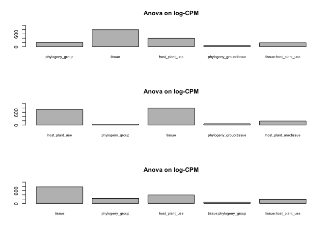

``` r
#dev.off()
```

### Principal component analysis.

Visualize two of the components, colored by tissue.

``` r
p <- prcomp(t(log.cpm.tmm))
comp1 <- 1
comp2 <- 2
plot(p$x[,c(comp1,comp2)], col=as.numeric(tissue_[colnames(counts)]),pch=20,main=paste0("PCs ", comp1, ",", comp2))
legend("topright", legend=c("Fat body","Gut","Labial gland","Malpighian tubules"),pch=20,col=1:4)
```

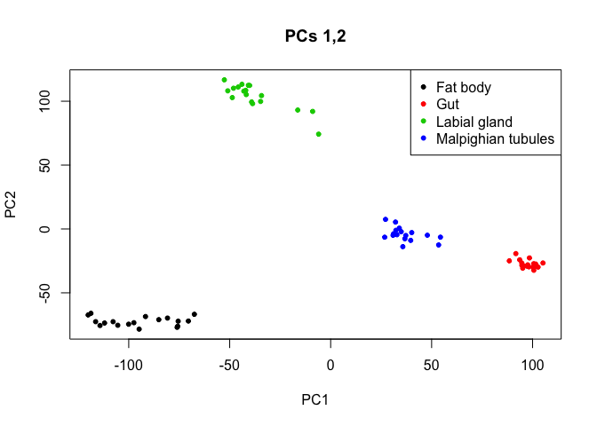

Color by other factors as well.

``` r
comp1 <- 1
comp2 <- 2
par(mfrow=c(2,2))
# Color by tissue
plot(p$x[,c(comp1,comp2)], col=as.numeric(tissue_[colnames(counts)]),pch=20,main=paste0("Tissue, PCs ", comp1, ",", comp2))
legend("topleft", legend=c("Fat body","Gut","Labial gland","Malpighian tubules"),pch=20,col=1:4,cex=0.75)
# Color by host plant
plot(p$x[,c(comp1,comp2)], col=as.numeric(hostplant_[colnames(counts)]),pch=20,main=paste0("Host plant, PCs ", comp1, ",", comp2))
legend("topleft", legend=unique(hostplant_),pch=20,col=1:length(unique(hostplant_)),cex=0.6)
# Color by phylogeny group
plot(p$x[,c(comp1,comp2)], col=as.numeric(pgroup_[colnames(counts)]),pch=20,main=paste0("Phylogroup, PCs ", comp1, ",", comp2))
legend("topleft", legend=unique(pgroup_),pch=20,col=1:length(unique(pgroup_)),cex=0.75)
# Color by core vs extended
plot(p$x[,c(comp1,comp2)], col=as.numeric(type_[colnames(counts)]),pch=20,main=paste0("CoreVsExtended, PCs ", comp1, ",", comp2))
legend("topright", legend=unique(type_),pch=20,col=1:length(unique(type_)))
```

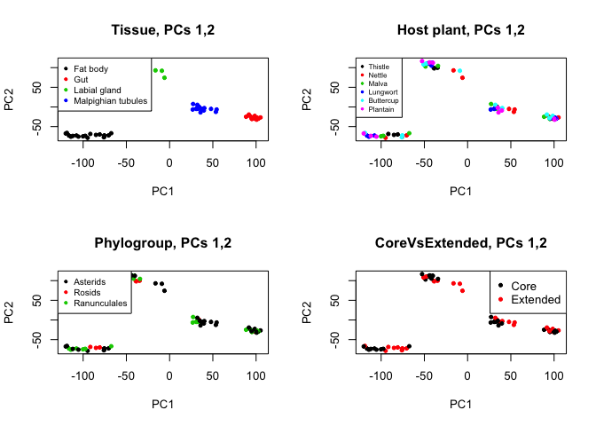

Let's look at gut samples only, colored by core vs extended.

``` r
comp1 <- 1
comp2 <- 2
subset <- meta[which(meta$Tissue=="Gut"),"Customer_ID"]
columns <- intersect(subset, colnames(tmm))
x <- tmm[,columns]

x.meta <- meta[which(meta$Tissue=="Labial gland"),]
x.log <- normalize.voom(x)

#p <- prcomp(t(x.log[which(rowMeans(x.log)>1),]))
p <- prcomp(t(x.log))
plot(p$x[,c(comp1,comp2)],  col=as.numeric(type_[colnames(x)]),pch=20,main=paste0("PCs ", comp1, ",", comp2))
```

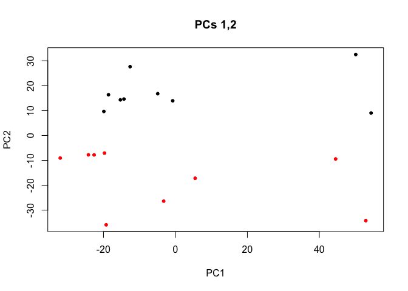

``` r
#par(mfrow=c(5,4))
#for (comp1 in 1:5){
#  for (comp2 in 1:5){
#       if (comp1 != comp2){
#   plot(p$x[,c(comp1,comp2)],  col=as.numeric(type_[colnames(x)]),pch=20,main=paste0("PCs ", comp1, ",", comp2))
#    #legend("topright",    legend=unique(family),pch=20,col=1:length(unique(family)))#
#     readline()
#    }
#}
#}
```

So PC2 reflects a core/extended split.

PCA of gut samples with more informative text labels, colored by core vs extended.

``` r
par(mfrow=c(1,1))
comp1 <- 1
comp2 <- 2
plot(p$x[,c(comp1,comp2)],  col=as.numeric(type_[colnames(x.log)]),pch=20,main=paste0("PCs ", comp1, ",", comp2))
legend("topright",  legend=unique(type_),pch=20,col=1:length(unique(type_)))
display.names <- paste(meta$Host_Plant,meta$Phylogeny_group,meta$Host.Plant.use,sep=".")
names(display.names) <- meta$Customer_ID
display.names.gut <- display.names[colnames(x.log)]
text(p$x[,comp1],p$x[,comp2],labels=display.names.gut,cex=0.6)
```

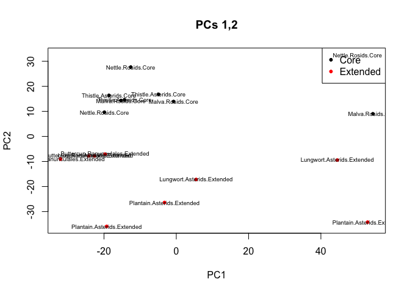

#### Correlations of PC scores to experimental variables

``` r
p <- prcomp(t(log.cpm.tmm))
#pdf("PC_correlations.pdf")
par(mfrow=c(2,2))
for (i in 1:4){
scores <- p$x[,i]
scores.o <- scores[meta$Customer_ID]

pvals <- vector()
pvals <- c(pvals, kruskal.test(scores.o, meta$Tissue)$p.value)
pvals <- c(pvals, kruskal.test(scores.o, meta$Phylogeny_group)$p.value)
pvals <- c(pvals, kruskal.test(scores.o, meta$Host.Plant.use)$p.value)
pvals <- c(pvals, kruskal.test(scores.o, meta$Host_Plant)$p.value)
pvals <- c(pvals, kruskal.test(scores.o, meta$Family)$p.value)
#pvals <- c(pvals, cor.test(scores.o, meta$Million_reads)$p.value)
names(pvals) <- c("Tissue","PhylogenyGroup","HostPlantUse","HostPlant","Family")
barplot(-log(pvals),las=2,ylab="Significance (-log(p))",main=paste("Principal component",i))
abline(2, 0, col="red")
}
```

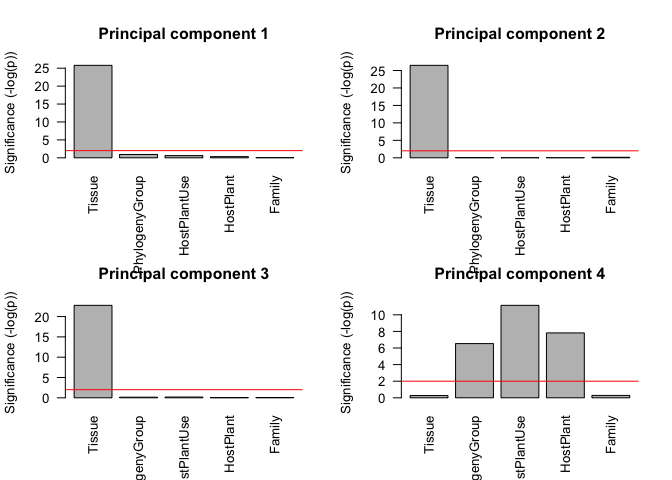

``` r
#dev.off()
```

### Surrogate variable analysis (SVA)

``` r
sampleinfo <- meta[,c("Host.Plant.use","Host_Plant", "Tissue", "Family", "Phylogeny_group")]
rownames(sampleinfo) <- meta$Customer_ID
data <- log.cpm.tmm[,rownames(sampleinfo)]
mod <- model.matrix(~as.factor(Tissue), data=sampleinfo)
mod0 <- model.matrix(~1, data=sampleinfo)
n.sv <- num.sv(data,mod,method="leek")
svobj <- sva(as.matrix(data),mod,mod0,n.sv=n.sv)
```

    ## Number of significant surrogate variables is:  3 
    ## Iteration (out of 5 ):1  2  3  4  5

``` r
surr <- svobj$sv
```

What is in the first two surrogate variables?

``` r
#pdf("SVA.pdf")
par(mfrow=c(2,1))
for (i in 1:2){
pvals <- vector()
pvals <- c(pvals, cor.test(surr[,i], as.numeric(sampleinfo$Host.Plant.use))$p.value)
pvals <- c(pvals, cor.test(surr[,i], as.numeric(sampleinfo$Host_Plant))$p.value)
pvals <- c(pvals, cor.test(surr[,i], as.numeric(sampleinfo$Phylogeny_group))$p.value)
pvals <- c(pvals, cor.test(surr[,i], as.numeric(sampleinfo$Family))$p.value)
names(pvals) <- c("HostPlantUse","HostPlant","PhylogenyGroup","Family")
barplot(-log(pvals),las=2,ylab="Significance (-log(p))",main=paste("PC", i))
abline(2,0,col="red")
}
```

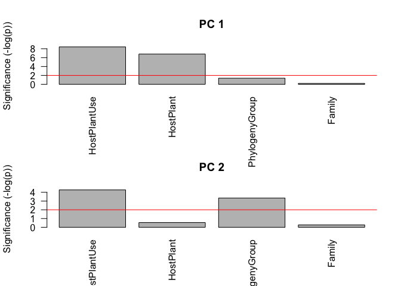

``` r
#dev.off()
```

Clustering with bootstrapping (pvclust) on gut samples. Commented out here due to long running time

``` r
# Using contigs with CPM > 1
# res <- pvclust(x.log[which(rowMeans(x)>1),],nboot=100,method.hclust="complete")
# Using all contigs
# res <- pvclust(x.log,nboot=100,method.hclust="complete")
# 1000 bootstrap samples for all contigs, complete linkage
# res <- pvclust(x.log,nboot=1000,method.hclust="complete")
#save(res, file="gut_pvclust_complete_1000.Robj")
#pdf("gut_ortho_pvclust_complete_100.pdf")
#plot(res)
#dev.off()
```

Core vs extended differential gene expression analysis
======================================================

### Core vs extended DE genes, Gut samples (n=18).

``` r
# DESeq2
subset <- meta[which(meta$Tissue=="Gut"),"Customer_ID"]
columns <- intersect(subset, colnames(counts))
meta.gut <- meta[which(meta$Tissue=="Gut"),]

dds <- DESeqDataSetFromMatrix(countData = counts[,columns], colData = meta.gut[,c("Customer_ID","Host.Plant.use","Phylogeny_group","Host_Plant","Family")], design = ~Family+Host.Plant.use)

dds <- DESeq(dds, betaPrior=FALSE)
```

    ## estimating size factors
    ## estimating dispersions
    ## gene-wise dispersion estimates
    ## mean-dispersion relationship
    ## final dispersion estimates
    ## fitting model and testing

``` r
res <- results(dds)
sig <- res[which(res$padj<0.01),]
sig.o <- sig[order(sig$padj),]
print(dim(sig.o))
```

    ## [1] 236   6

``` r
write.table(sig.o,file="sig_gut_corevsextended_DESeq2_0.01.txt",quote=F)

# Phylogeny group in gut
dds <- DESeqDataSetFromMatrix(countData = counts[,columns], colData = meta.gut[,c("Customer_ID","Host.Plant.use","Phylogeny_group","Host_Plant","Family")], design = ~Family+Phylogeny_group)
dds <- DESeq(dds, betaPrior=FALSE)
```

    ## estimating size factors
    ## estimating dispersions
    ## gene-wise dispersion estimates
    ## mean-dispersion relationship
    ## final dispersion estimates
    ## fitting model and testing

``` r
res <- results(dds)

rr <- results(dds,contrast=c("Phylogeny_group","Ranunculales","Rosids"))
write.table(rr,file="gut_ranunc_ros_DESeq2_0.01.txt",quote=F)
ra <- results(dds,contrast=c("Phylogeny_group","Ranunculales","Asterids"))
write.table(ra,file="gut_ranunc_ast_DESeq2_0.01.txt",quote=F)
ar <- results(dds,contrast=c("Phylogeny_group","Asterids","Rosids"))
write.table(ar,file="gut_ast_ros_DESeq2_0.01.txt",quote=F)
```

### Core vs extended DE genes,Labial gland

``` r
subset <- meta[which(meta$Tissue=="Labial gland"),"Customer_ID"]
columns <- intersect(subset, colnames(counts))
meta.lab <- meta[which(meta$Tissue=="Labial gland"),]

dds <- DESeqDataSetFromMatrix(countData = counts[,columns], colData = meta.lab[,c("Customer_ID","Host.Plant.use","Phylogeny_group","Host_Plant","Family")], design = ~Family+Host.Plant.use)

dds <- DESeq(dds, betaPrior=FALSE)
```

    ## estimating size factors
    ## estimating dispersions
    ## gene-wise dispersion estimates
    ## mean-dispersion relationship
    ## final dispersion estimates
    ## fitting model and testing

``` r
res <- results(dds)
sig <- res[which(res$padj<0.01),]
sig.o <- sig[order(sig$padj),]
print(dim(sig.o))
```

    ## [1] 274   6

``` r
write.table(sig.o,file="sig_labialgland_corevsextended_DESeq2_0.01.txt",quote=F)

# Phylogeny group in labial
dds <- DESeqDataSetFromMatrix(countData = counts[,columns], colData = meta.lab[,c("Customer_ID","Host.Plant.use","Phylogeny_group","Host_Plant","Family")], design = ~Family+Phylogeny_group)
dds <- DESeq(dds, betaPrior=FALSE)
```

    ## estimating size factors
    ## estimating dispersions
    ## gene-wise dispersion estimates
    ## mean-dispersion relationship
    ## final dispersion estimates
    ## fitting model and testing

``` r
res <- results(dds)

rr <- results(dds,contrast=c("Phylogeny_group","Ranunculales","Rosids"))
write.table(rr,file="labial_ranunc_ros_DESeq2_0.01.txt",quote=F)
ra <- results(dds,contrast=c("Phylogeny_group","Ranunculales","Asterids"))
write.table(ra,file="labial_ranunc_ast_DESeq2_0.01.txt",quote=F)
ar <- results(dds,contrast=c("Phylogeny_group","Asterids","Rosids"))
write.table(ar,file="labial_ast_ros_DESeq2_0.01.txt",quote=F)
```

### Core vs extended DE genes, Fat body

``` r
subset <- meta[which(meta$Tissue=="Fat body"),"Customer_ID"]
columns <- intersect(subset, colnames(counts))
meta.fat <- meta[which(meta$Tissue=="Fat body"),]

dds <- DESeqDataSetFromMatrix(countData = counts[,columns], colData = meta.fat[,c("Customer_ID","Host.Plant.use","Phylogeny_group","Host_Plant","Family")], design = ~Family+Host.Plant.use)

dds <- DESeq(dds, betaPrior=FALSE)
```

    ## estimating size factors
    ## estimating dispersions
    ## gene-wise dispersion estimates
    ## mean-dispersion relationship
    ## final dispersion estimates
    ## fitting model and testing

``` r
res <- results(dds)
sig <- res[which(res$padj<0.01),]
sig.o <- sig[order(sig$padj),]
print(dim(sig.o))
```

    ## [1] 695   6

``` r
write.table(sig.o,file="sig_fatbody_corevsextended_DESeq2_0.01.txt",quote=F)

# Phylogeny group in fat body
dds <- DESeqDataSetFromMatrix(countData = counts[,columns], colData = meta.fat[,c("Customer_ID","Host.Plant.use","Phylogeny_group","Host_Plant","Family")], design = ~Family+Phylogeny_group)
dds <- DESeq(dds, betaPrior=FALSE)
```

    ## estimating size factors
    ## estimating dispersions
    ## gene-wise dispersion estimates
    ## mean-dispersion relationship
    ## final dispersion estimates
    ## fitting model and testing

``` r
res <- results(dds)

rr <- results(dds,contrast=c("Phylogeny_group","Ranunculales","Rosids"))
write.table(rr,file="fatbody_ranunc_ros_DESeq2_0.01.txt",quote=F)
ra <- results(dds,contrast=c("Phylogeny_group","Ranunculales","Asterids"))
write.table(ra,file="fatbody_ranunc_ast_DESeq2_0.01.txt",quote=F)
ar <- results(dds,contrast=c("Phylogeny_group","Asterids","Rosids"))
write.table(ar,file="fatbody_ast_ros_DESeq2_0.01.txt",quote=F)
```

### Core vs extended DE genes, Malpighian tubules

``` r
subset <- meta[which(meta$Tissue=="Malpighian tubules"),"Customer_ID"]
columns <- intersect(subset, colnames(counts))
meta.mal <- meta[which(meta$Tissue=="Malpighian tubules"),]
dds <- DESeqDataSetFromMatrix(countData = counts[,columns], colData = meta.mal[,c("Customer_ID","Host.Plant.use","Phylogeny_group","Host_Plant","Family")], design = ~Family+Host.Plant.use)

dds <- DESeq(dds, betaPrior=FALSE)
```

    ## estimating size factors
    ## estimating dispersions
    ## gene-wise dispersion estimates
    ## mean-dispersion relationship
    ## final dispersion estimates
    ## fitting model and testing

``` r
res <- results(dds)
sig <- res[which(res$padj<0.01),]
sig.o <- sig[order(sig$padj),]
print(dim(sig.o))
```

    ## [1] 80  6

``` r
write.table(sig.o,file="sig_malpi_corevsextended_DESeq2_0.01.txt",quote=F)

# 
dds <- DESeqDataSetFromMatrix(countData = counts[,columns], colData = meta.mal[,c("Customer_ID","Host.Plant.use","Phylogeny_group","Host_Plant","Family")], design = ~Family+Phylogeny_group)
dds <- DESeq(dds, betaPrior=FALSE)
```

    ## estimating size factors
    ## estimating dispersions
    ## gene-wise dispersion estimates
    ## mean-dispersion relationship
    ## final dispersion estimates
    ## fitting model and testing

``` r
res <- results(dds)

rr <- results(dds,contrast=c("Phylogeny_group","Ranunculales","Rosids"))
write.table(rr,file="malpi_ranunc_ros_DESeq2_0.01.txt",quote=F)
ra <- results(dds,contrast=c("Phylogeny_group","Ranunculales","Asterids"))
write.table(ra,file="malpi_ranunc_ast_DESeq2_0.01.txt",quote=F)
ar <- results(dds,contrast=c("Phylogeny_group","Asterids","Rosids"))
write.table(ar,file="malpi_ast_ros_DESeq2_0.01.txt",quote=F)
```

DESeq overall differential expression between phylogenetic groups
=================================================================

Using all samples, with family and tissue as factors.

``` r
plotphylo <- function(sig, counts){
for (gene in head(rownames(sig))){
  expr <- t(counts[gene,]/colSums(counts))
  temp <- data.frame(expr=expr, tissue=meta$Tissue, phylo=meta$Phylogeny_group)
  print(bwplot(expr~phylo|tissue, data=temp, main=gene))
}
}
```

DESeq: Rosids vs. Ranunculales
------------------------------

``` r
columns <- intersect(meta$Customer_ID, colnames(counts))
counts_ <- counts[,columns]

dds <- DESeqDataSetFromMatrix(countData = counts_, colData = meta[,c("Customer_ID","Host.Plant.use","Phylogeny_group","Host_Plant","Tissue","Family")], design = ~Tissue+Family+Phylogeny_group)

dds <- DESeq(dds, betaPrior=FALSE, fitType="local")
```

    ## estimating size factors
    ## estimating dispersions
    ## gene-wise dispersion estimates
    ## mean-dispersion relationship
    ## final dispersion estimates
    ## fitting model and testing

``` r
#res <- results(dds, contrast=c("Phylogeny_group","Rosids","Asterids"))
res <- results(dds, contrast=c("Phylogeny_group","Rosids","Ranunculales"))
#res <- results(dds, contrast=c("Phylogeny_group","Ranunculales","Asterids"))
sig <- res[which(res$padj<0.01),]
sig.o <- sig[order(sig$padj),]
print(head(sig.o))
```

    ## log2 fold change (MLE): Phylogeny_group Rosids vs Ranunculales 
    ## Wald test p-value: Phylogeny_group Rosids vs Ranunculales 
    ## DataFrame with 6 rows and 6 columns
    ##                   baseMean log2FoldChange     lfcSE      stat       pvalue
    ##                  <numeric>      <numeric> <numeric> <numeric>    <numeric>
    ## HMEL009626-PA  692.9861747       3.084385 0.1600844 19.267237 1.011956e-82
    ## HMEL008644-PA   82.0671144       3.694179 0.3184821 11.599331 4.153115e-31
    ## HMEL007175-PA    3.9051899      18.759953 1.8842936  9.955961 2.375173e-23
    ## HMEL005123-PA    0.1887582     -34.083737 3.5729178 -9.539469 1.435661e-21
    ## HMEL002164-PA    0.1455243     -20.455552 2.2332143 -9.159691 5.204625e-20
    ## HMEL012417-PA 1573.4694606       1.499306 0.1690040  8.871422 7.221744e-19
    ##                       padj
    ##                  <numeric>
    ## HMEL009626-PA 1.001735e-78
    ## HMEL008644-PA 2.055584e-27
    ## HMEL007175-PA 7.837281e-20
    ## HMEL005123-PA 3.552903e-18
    ## HMEL002164-PA 1.030412e-16
    ## HMEL012417-PA 1.191467e-15

``` r
print(dim(sig.o))
```

    ## [1] 664   6

``` r
plotphylo(sig.o, counts_)
```

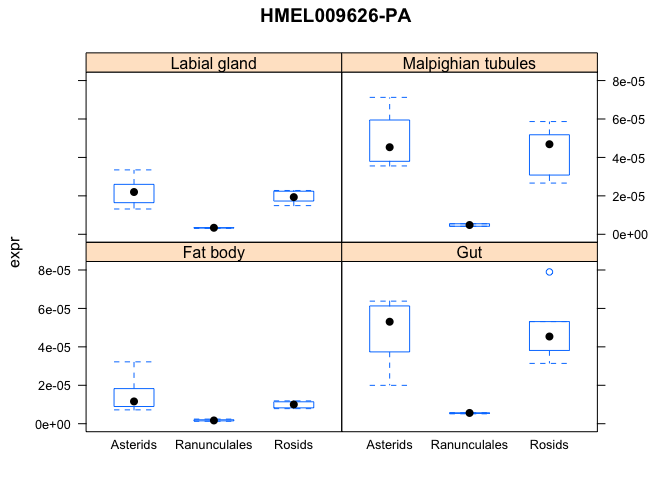 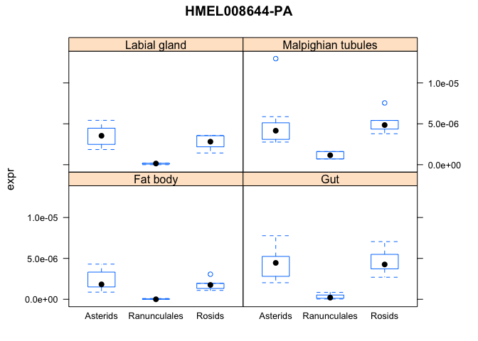 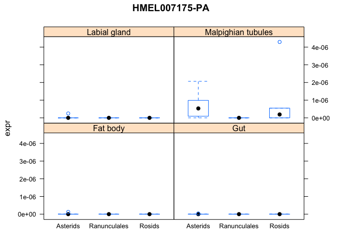 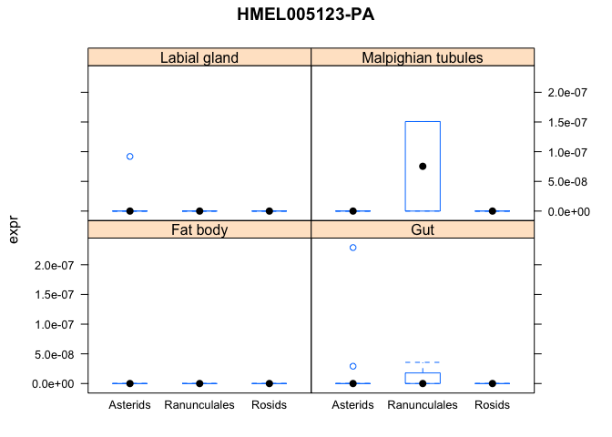 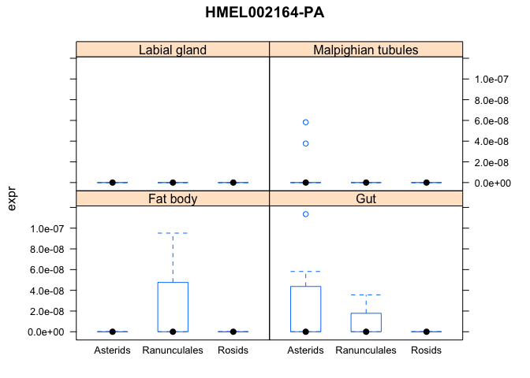 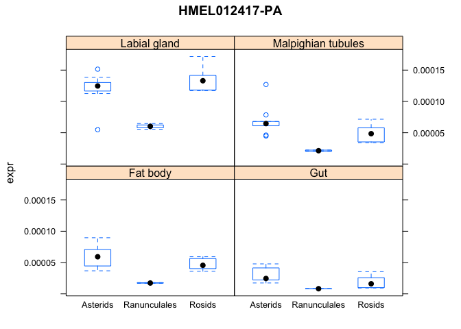

``` r
write.table(sig.o,file="sig_rosids_ranunc_alltissues_DESeq2_0.01.txt",quote=F)
```

DESeq: Rosids vs. Asterids
--------------------------

``` r
res <- results(dds, contrast=c("Phylogeny_group","Rosids","Asterids"))
sig <- res[which(res$padj<0.01),]
sig.o <- sig[order(sig$padj),]
print(head(sig.o))
```

    ## log2 fold change (MLE): Phylogeny_group Rosids vs Asterids 
    ## Wald test p-value: Phylogeny group Rosids vs Asterids 
    ## DataFrame with 6 rows and 6 columns
    ##                   baseMean log2FoldChange     lfcSE       stat
    ##                  <numeric>      <numeric> <numeric>  <numeric>
    ## HMEL002164-PA    0.1455243     -19.541255 1.6975886 -11.511184
    ## HMEL005123-PA    0.1887582     -29.368345 2.6782477 -10.965507
    ## HMEL013520-PA    0.3061345     -19.307999 2.0850368  -9.260268
    ## HMEL009851-PA    0.1684476     -26.119007 3.0962314  -8.435741
    ## HMEL004610-PA 1284.7012288       4.156779 0.4949877   8.397743
    ## HMEL009203-PA    0.8043228     -28.107716 3.3876683  -8.297069
    ##                     pvalue         padj
    ##                  <numeric>    <numeric>
    ## HMEL002164-PA 1.158767e-30 1.147063e-26
    ## HMEL005123-PA 5.598560e-28 2.771007e-24
    ## HMEL013520-PA 2.039203e-20 6.728690e-17
    ## HMEL009851-PA 3.291098e-17 8.144646e-14
    ## HMEL004610-PA 4.551436e-17 9.010932e-14
    ## HMEL009203-PA 1.067119e-16 1.760568e-13

``` r
print(dim(sig.o))
```

    ## [1] 1574    6

``` r
plotphylo(sig.o, counts_)
```

  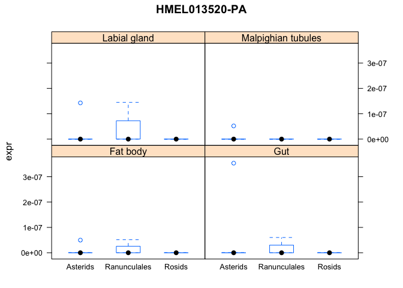 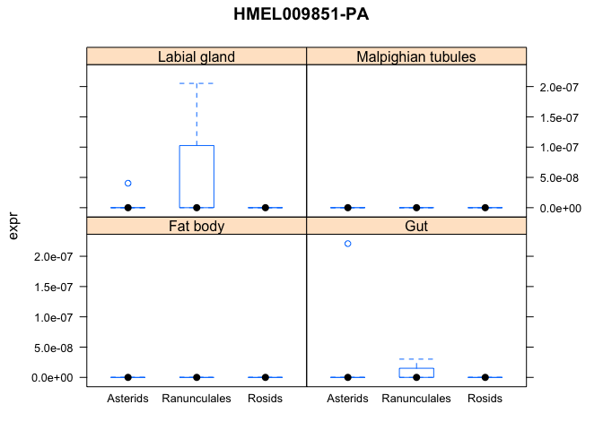 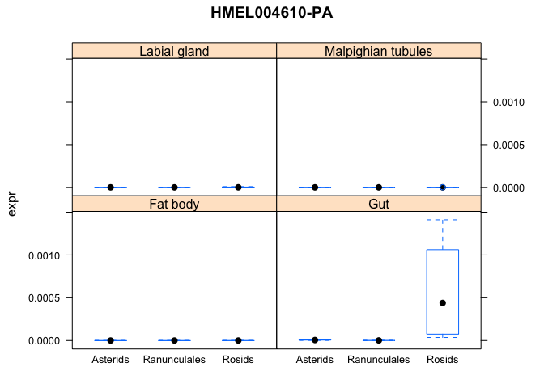 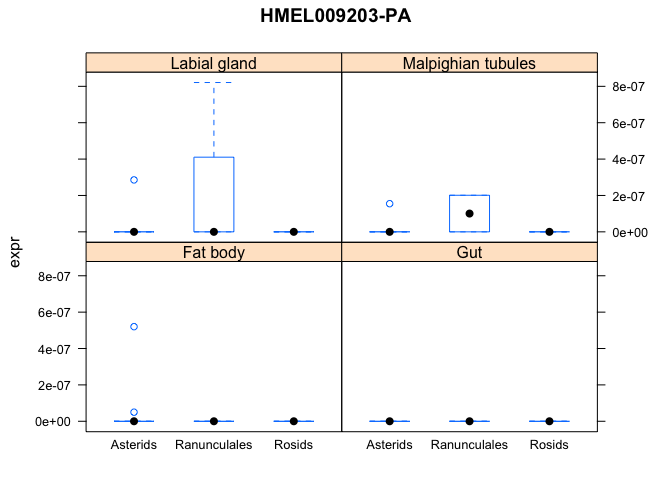

``` r
write.table(sig.o,file="sig_rosids_asterids_alltissues_DESeq2_0.01.txt",quote=F)
```

DESeq: Ranunculales vs. Asterids
--------------------------------

``` r
res <- results(dds, contrast=c("Phylogeny_group","Ranunculales","Asterids"))
sig <- res[which(res$padj<0.01),]
sig.o <- sig[order(sig$padj),]
print(head(sig.o))
```

    ## log2 fold change (MLE): Phylogeny_group Ranunculales vs Asterids 
    ## Wald test p-value: Phylogeny group Ranunculales vs Asterids 
    ## DataFrame with 6 rows and 6 columns
    ##                 baseMean log2FoldChange     lfcSE      stat        pvalue
    ##                <numeric>      <numeric> <numeric> <numeric>     <numeric>
    ## HMEL009626-PA  692.98617      -3.241173 0.1524731 -21.25735 2.819183e-100
    ## HMEL008644-PA   82.06711      -3.845777 0.3064722 -12.54853  4.049390e-36
    ## HMEL007175-PA    3.90519     -20.156120 1.7861722 -11.28453  1.564696e-29
    ## HMEL012417-PA 1573.46946      -1.771187 0.1600256 -11.06815  1.790558e-28
    ## HMEL006882-PA 3306.66033      -1.753259 0.1624629 -10.79175  3.765454e-27
    ## HMEL005487-PA 1693.12783       1.078915 0.1041595  10.35830  3.837185e-25
    ##                       padj
    ##                  <numeric>
    ## HMEL009626-PA 2.790709e-96
    ## HMEL008644-PA 2.004245e-32
    ## HMEL007175-PA 5.162975e-26
    ## HMEL012417-PA 4.431185e-25
    ## HMEL006882-PA 7.454846e-24
    ## HMEL005487-PA 6.330715e-22

``` r
print(dim(sig.o))
```

    ## [1] 2220    6

``` r
plotphylo(sig.o, counts_)
```

    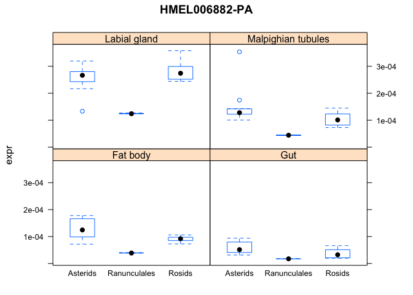 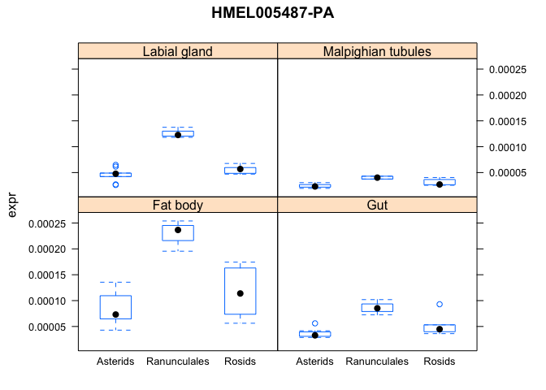

``` r
write.table(sig.o,file="sig_ranunc_asterids_alltissues_DESeq2_0.01.txt",quote=F)
```
